**Objetivo:**

Familiarizarnos con los conceptos de Sistemas de Control de Versiones (VCSs, en sus siglas en inglés) y los fundamentos de Git. Entender cómo descargar Git y configurarlo e identificar si ya se encuentra instalado en nuestro sistema en el caso de sistemas operativos basados en UNIX (Mac y GNU/Linux).

**Instrucciones:**
Leer y analizar los recursos listados a continuación. Se recomienda ver el video indicado por cada enlace.

Para entender Git, primero debemos comprender de que se trata de un sistema de control de versiones, pero ¿Qué es un  control de versiones, y por qué debería ser importante en el flujo de trabajo?

<a href="https://www.youtube.com/watch?v=jGehuhFhtnE&feature=youtu.be&t=117" target="_blank">Un control de versiones es un sistema que registra los cambios realizados en un archivo o conjunto de archivos</a> **(Ver video hasta el minuto 4:10)**, de modo que puedas recuperar versiones específicas en caso de ser requeridas, posiblemente si tu perfil es diferente al de un desarrollador pensaras que no es necesario integrarlo a tu flujo de trabajo, pero los sistemas de control de versiones pueden ayudar a mantener un historial de cambios de distintos archivos, como es el caso de imágenes o documentos. Si eres diseñador gráfico, escritor o cualquiera que sea tu  área de especialidad usar un sistema de control de versiones es una decisión muy acertada.

Existen diversos sistemas y métodos de control de versiones, un método usado por muchas personas es copiar los archivos a otro directorio (donde  pueden agregar la fecha y la hora de la versión), este método es muy común por su nivel de sencillez, pero también es muy fácil cometer errores, para afrontar este problema se desarrollaron los **VCS Locales** que tienen una simple base de datos que lleva el registro de los cambios, el siguiente problema con el que nos podríamos encontrar es al momento de trabajar de forma colaborativa de diversos sistemas, por lo que se desarrollaron  los **Sistemas de Control de Versiones Centralizados (CVCS).**

Algunos de estos sistemas fueron <a href="https://es.wikipedia.org/wiki/Subversion_(software)" target="_blank">Subversion</a> y Perforce, donde se tiene un único servidor que contiene todos los archivos versionados y por medio de clientes se descargan los archivos desde ese nodo central, el mayor problema que se podría generar con estos sistemas es que al tener todo en un solo lugar el riesgo  de perderlo todo por una falla era considerable y es así como evolucionamos a los **Sistemas de Control de Versiones Distribuidos (DVCS)**, como lo son Git, Mercurial, Bazaar o Darcs, muchos de estos sistemas se encargan de manejar numerosos repositorios remotos, esto nos permite establecer varios flujos de trabajo que no son posibles con sistemas centralizados.

**La historia de Git**

Git comenzó un poco de la destrucción creativa y una gran polémica.

En el 2005 la comunidad encargada del desarrollo del Kernel Linux usaba la herramienta DVCS de Bitkeeper pero esta relación dejó de funcionar al dejar de estar  disponible esta herramienta de forma gratuita. Esto impulsó a la comunidad y en particular a <a href="https://www.youtube.com/watch?v=iNFtX2ctExM" target="_blank">Linux Torvalds</a> **(video: Torvalds explica por qué hizo git)**, el creador de Linux a desarrollar su propia herramienta con los siguientes objetivos:

- Velocidad
- Diseño sencillo
- Gran Soporte para desarrollo no lineal (Ramas)
- Completamente distribuido
- Capaz de manejar grandes proyectos

**Fundamentos de Git**

La principal diferencia entre Git y cualquier otro VCS es la forma en la que manejan su datos. Conceptualmente, la mayoría de los otros sistema almacenan la información como una lista de cambios en los archivos y las modificaciones hechas a cada una de ellos a través del tiempo.

<a href="http://raulavila.com/2017/01/como-funciona-git-1/">Git en cambio maneja sus datos como un conjunto de copias instantáneas</a> **(articulo: Comó funciona el núcleo de Git)** de un sistema de archivos miniatura. Cada vez que confirmamos un cambio o guardamos el estado del proyecto, básicamente toma una foto del aspecto de todos los archivos en ese momento y guarda una referencia a esa copia. Para ser eficiente los archivos que no se han modificado Git no los almacena en el archivo nuevo, sino como un enlace al archivo anterior idéntico que ya se tiene almacenado.

**Línea de Comandos**

Existen muchas forma de usar Git. Por un lado tenemos las herramientas originales de línea de comandos y por otro existen interfaces gráficas como es el caso de la <a href="https://desktop.github.com/" target="_blank">aplicación de GitHub</a> (Para sistemas Mac y Windows), el problema de las interfaces es  que en muchas ocasiones para lograr resolver problemas tendremos que recurrir a la línea de comandos.

Para comenzar a trabajar con Git en el caso de los usuarios UNIX (Mac y GNU/Linux) no será necesario instalar programas adicionales , por lo que usaremos la terminal por defecto del sistema, en el caso de usuarios windows tendremos que instalar GitBash y Git al Sistema.

**Instalación de Git**

Como lo mencionamos anteriormente Git se encuentra instalado en los sistemas UNIX, pero incluso si ya está instalado es posiblemente un buen momento para actualizarlo a su última versión.

**Instalación en GNU/Linux**

Para instalaciones en sistemas basados en Fedora, puedes utilizar yum:

`$ yum install git`

En el caso de distribuciones basadas en Debian, puedes usar apt-get:

`$ apt-get install git`

Para opciones adicionales de instalación en diferentes sistemas Unix se puede consultar la documentación  oficial <a href="http://git-scm.com/download/linux" target="_blank">http://git-scm.com/download/linux</a>

Video Tutorial: <a href="https://www.youtube.com/watch?v=qMqh5qoXNWA" target="_blank">https://www.youtube.com/watch?v=qMqh5qoXNWA</a>

**Instalación en Mac**

La forma más sencilla de instalar Git en su última versión es instalando Xcode y la herramienta de línea de comandos de <a href="https://apps.apple.com/mx/app/xcode/id497799835?mt=12" target="_blank">Xcode desde la App Store</a>, una vez instalado el sistema actualizará a la versión más reciente estable.

Si deseas instalar de forma manual evitando instalar xcode, se puede descargar desde la documentación oficial. <a href="http://git-scm.com/download/mac" target="_blank">http://git-scm.com/download/mac</a>

Video Tutorial: <a href="https://www.youtube.com/watch?v=ovT94YIHIBE " target="_blank">https://www.youtube.com/watch?v=ovT94YIHIBE</a>

**Instalación en Windows**

El método más sencillo y oficial de instalar Git en windows es por medio de instalador que se encuentra en la siguiente url <a href="http://git-scm.com/download/win" target="_blank">http://git-scm.com/download/win</a> y la descarga comenzará automáticamente.

Video Tutorial: <a href="https://www.youtube.com/watch?v=ES2xtLyI-B8" target="_blank">https://www.youtube.com/watch?v=ES2xtLyI-B8</a>

**Configurar Git**

Una vez instalado Git en el sistema, es necesario realizar unas pequeñas configuraciones.

Lo primero que debemos realizar es configurar la identidad, debemos establecer el nombre de usuario y dirección de correo electrónico. Esto es importante porque cada que realicemos un **“commit”** (Registro de cambio) git usa esta información para registrar quien realizó este cambio.

<a href="https://www.youtube.com/watch?v=lSpTok3_Jqw&list=PLmUnyBCRHkvUPkrsseI1SmMtYgfc-f8Kn&index=2" target="_blank">Para realizar esta acción debemos abrir nuestra terminal o aplicación GitBash</a> **(video tutorial)**  en los sistemas Windows y escribir la siguiente línea de código  para establecer nuestro nombre  de usuario entre las comillas dobles “ ”

` git config --global user.name "Nombre de Usuario" `

A continuación para establecer el correo electrónico que usaremos ingresamos la siguiente línea de código

` git config --global user.email micorreo@example.com `

Por defecto Git trabaja con el editor <a href="https://es.wikipedia.org/wiki/Vim" target="_blank">VIM</a> , puedes elegir el editor de texto de tu preferencia, como es el caso de <a href="https://es.wikipedia.org/wiki/Emacs" target="_blank">Emacs</a> . Para realizar este cambio se debe escribir la siguiente línea:

`git config --global core.editor emacs`

**Nota:** Vim y Emacs son editores de texto frecuentemente usados por desarrolladores en sistemas basados en Unix como Linux y Mac. Si no estás familiarizado con ninguno de estos editores o estás en un sistema Windows recomendamos no cambiar esta configuración.

Una vez realizada la configuración, puedes usar el comando `git config --list` para mostrar todas las propiedades que Git ha configurado.

**Primeros pasos**

Una de las palabras que siempre escucharas al tratarse de Git será <a href="https://es.wikipedia.org/wiki/Repositorio#Software" target="_blank">repositorios</a>, un repositorio es el almacenamiento de un proyecto en Git, estos proyectos pueden encontrarse de forma local o remota, por lo cual es necesario comprender cómo inicializar un repositorio o **clonar** uno ya existente de forma remota, así también de cómo ir gestionando los cambios que realicemos.

Antes de comenzar a realizar tu primer repositorio, será importante aprender a desplazarte por la terminal o GitBash entre directorios, los <a href="https://www.youtube.com/watch?v=mngGNike_eA&feature=youtu.be&t=42" target="_blank">comandos básicos </a>**(video tutorial**) que más frecuente usaras son los siguientes:

|Comando |Función |
| ------ | ------ |
| ls | Sirve para listar los archivos y carpetas que hay dentro del directorio en el que estés |
| cd | Este comando sirve para cambiar de directorio;por ejemplo si estás en `/home/directorio/` y quieres pasar a `/home/directorio2/`, tendrías que escribir: `cd /home/directorio2/` Si quieres pasar a un directorio superior o regresar al directorio en el que te encontrabas, tendrías que escribir `cd ..`|
| mkdir | Este comando sirve para crear nuevos directorios; por ejemplo:`mkdir nuevoDirectorio`|
| rm | Si queremos borrar algún archivo o directorio podemos hacer uso del comando rm y el nombre del archivo que  deseamos borrar; por ejemplo: `rm archivo.txt` Para borrar directorios es necesario usar el atributo -rf; por ejemplo: `rm -rf /directorio/ `|

**Inicializando nuestro primer repositorio en un directorio existente**

Para comenzar nuestro primer repositorio, debemos dirigirnos al directorio (carpeta) en donde queremos inicializar nuestro proyecto dentro de nuestra terminal o git bash por medio del comando `cd`, también podemos generar un nuevo directorio con el comando `mkdir` y el nombre del directorio.

Una vez dentro del directorio usaremos el comando

`git init`

Esta acción creará un subdirectorio nuevo llamado .git, el cual contiene todos los archivos necesarios del repositorio, para poder visualizar dicho directorio tendremos que usar el comando `ls -A` (al agregar el comando -A al comando ls nos permite visualizar los archivos ocultos).

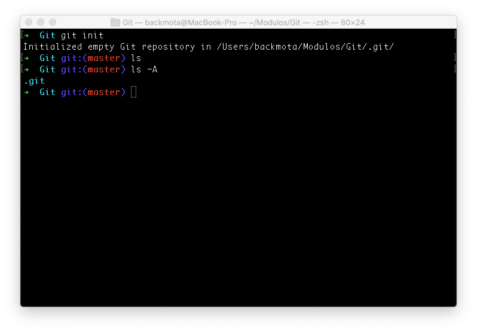

Con el comando cd podemos entrar en el subdirectorio .git y ver su contenido. Por el momento no será necesario mover ninguno de los archivos creados aquí, pero para conocer a fondo el funcionamiento interno de git puedes consultar el siguiente <a href="https://git-scm.com/book/es/v2/Los-entresijos-internos-de-Git-Fontaner%C3%ADa-y-porcelana#ch10-git-internals" target="_blank">Link</a>.

En este momento el repositorio se encuentra vacío y no contiene nada dentro de la lista seguimiento, crearemos un primer archivo dentro del directorio por medio de <a href="https://es.wikipedia.org/wiki/Vim">VIM</a> , para invocarlo usaremos el comando `vim [nombre del archivo] `

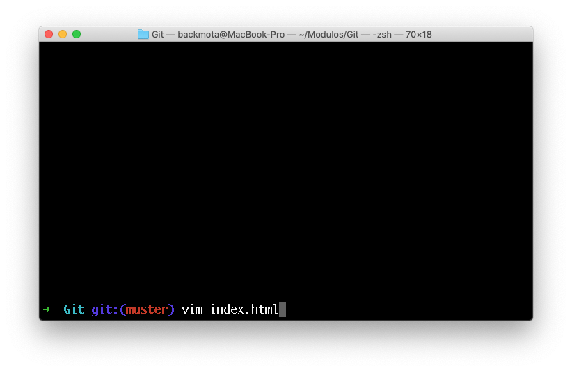

Nos desplegará una pantalla con el editor, para comenzar a escribir en este editor tecleamos la tecla **i** (En la parte inferior aparecerá el texto **-- INSERT --**)

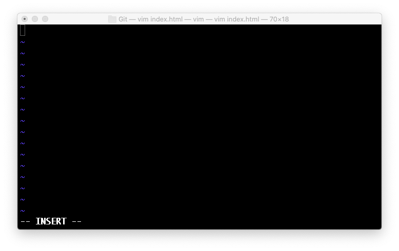

Podremos escribir el contenido libremente, para proceder a guardar el cambio tecleamos la tecla **esc**, esto nos permitirá escribir en la barra inferior de la terminal y pondremos el siguiente texto **:x** seguido por la tecla **enter** (los comando en vim comienzan con dos puntos, la tecla x indica que queremos guardar los cambios).

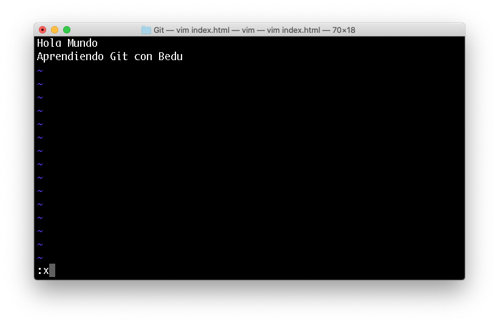

A continuación usaremos el comando `git status`, este comando nos mostrará el staging area o área de preparación, nos aparecerá la leyenda **Untracked files** que nos estará indicando que se encuentran archivos dentro del repositorio, pero que git aún no los tiene rastreados para su seguimiento.

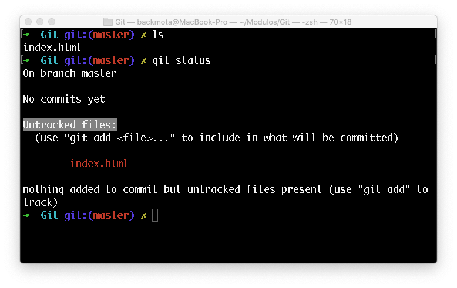

Para agregar los nuevos archivos al seguimiento de git usaremos el comando `git add [nombre del archivo]` o `git add -A` (Para agregar todos los archivos nuevos en caso de tratarse de varios archivos), con el comando `git status` verificaremos que los archivos que queremos trackear fueron agregados correctamente e indicará que existen cambios para realizar un <a href="https://es.wikipedia.org/wiki/Commit" target="_blank">commit</a>.

Para realizar el commit usaremos el comando `git commit -m “[Mensaje del commit]”`, seguido por la tecla enter; por ejemplo: `git commit -m “Mi primer Commit en Git”`

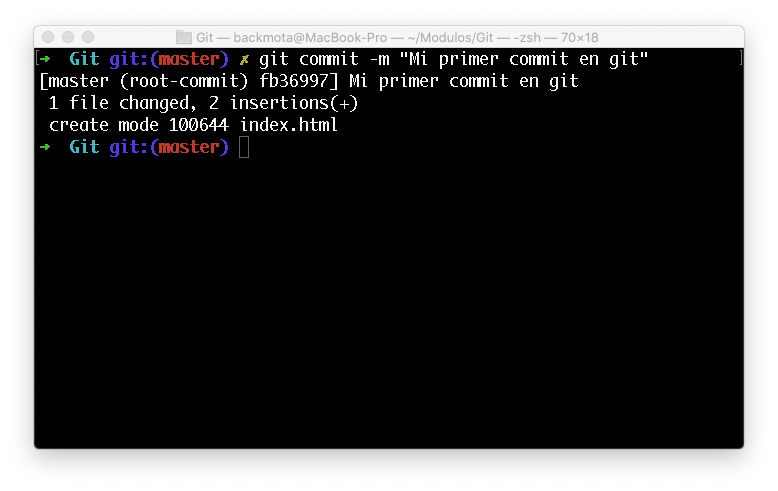

Si volvemos a invocar el comando de `git status` nos mostrará un mensaje que actualmente el árbol de trabajo o área de trabajo (working tree) se encuentra limpio, eso significa que todos los archivos y sus cambios se encuentran actualizados en nuestro repositorio.

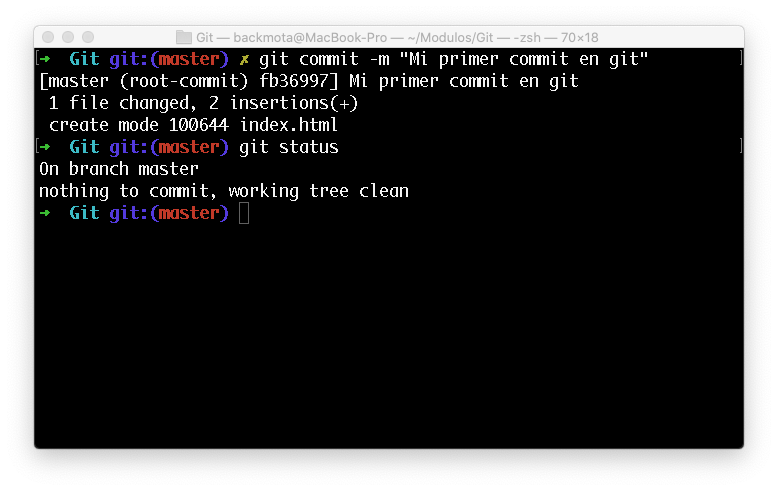

Realizaremos un pequeño cambio en el archivo **index.html **nuevamente utilizando el editor VIM, por lo que debemos usar el comando `vim index.html` en nuestra terminal, escribiremos una línea más (para comenzar a escribir es necesario teclear la tecla **i** una vez abierto vim) y guardaremos los cambios con el comando **esc** + **:x** , una vez guardado los cambios invocamos el comando `git status`, que nos dará como respuesta que el archivo fue index.html fue modificado.

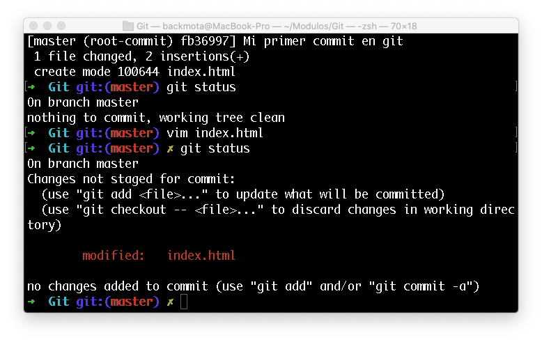

Agregaremos el archivo con cambios a nuestra área de preparación (staging area) nuevamente con el comando `git add -A `y realizaremos un nuevo commit indicando que el archivo fue modificado con el comando `git commit -m “Agregando una nueva línea a index.html”`

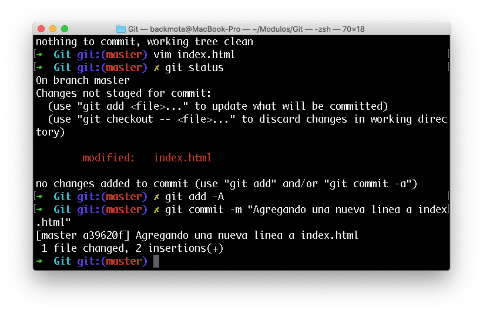

A continuación usaremos el comando `git log`, que nos mostrará el historial de cambios (commits) realizados en nuestro repositorio. Para salir de la ventana log tecleamos la tecla **q**

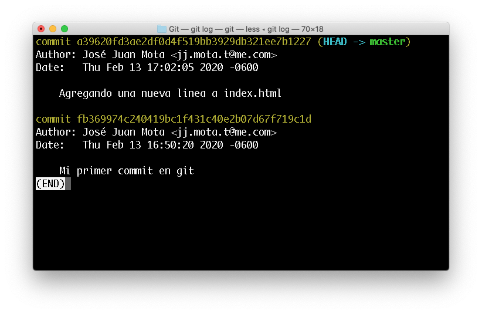

En el siguiente <a href="https://www.youtube.com/watch?v=UJGKWMHX038" target="_blank">video</a> podrás encontrar una explicación del ejercicio realizado anteriormente con la diferencia de que los archivos index.html se van a crear a partir de un <a href="https://es.wikipedia.org/wiki/Editor_de_texto" target="_blank">editor de texto</a>.

**Clonando un repositorio existente**

Si deseas obtener una copia de un repositorio Git existente de algún servidor o servicios como <a href="https://es.wikipedia.org/wiki/GitHub" target="_blank">Github</a> o <a href="https://es.wikipedia.org/wiki/GitLab" target="_blank">GitLab</a>, usaremos el comando `git clone`, esto creará un directorio con el nombre del repositorio, por ejemplo para clonar el repositorio de este módulo abriremos la terminal o GitBash y nos dirigiremos con el comando `cd` al directorio donde se creará el directorio con el repositorio a clonar e ingresamos el siguiente comando que se encuentra compuesto por git clone y una url de github.

`git clone https://github.com/beduExpert/Curso-Introductorio-Git-2020.git`

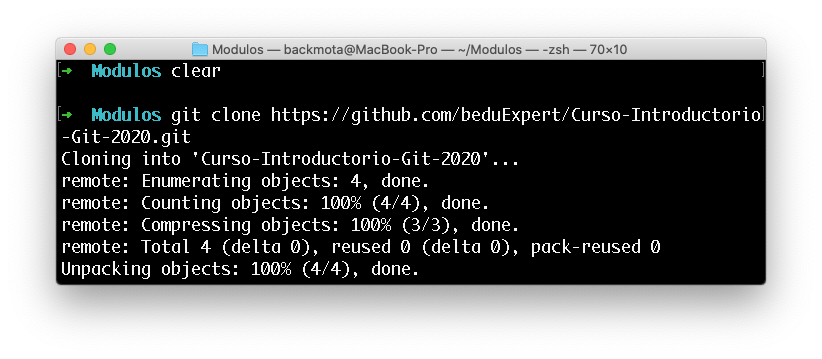

Una vez creado ingresamos con el comando `cd Curso-Introductorio-Git-2020` y con el comando `ls` podremos ver el contenido del repositorio clonado.

Git permite usar distintos protocolos de transferencia. En el ejemplo usado utilizamos https, pero también se puede utilizar el protocolo SSH, en la sesión 3 de este módulo utilizaremos dicho protocolo para realizar la conexión de nuestros repositorios locales a servidores remotos.

