# Sesión 2: Ramificación

### **Objetivo:**

Comprender cómo deshacer cosas en Git. Entender los los flujos de trabajo y los métodos de ramificación, así como su gestión y organización.

### Instrucciones:

Leer y analizar los recursos listados a continuación.Se recomienda ver el video indicado por cada enlace.

### **Git Ignore**

En ocasiones es necesario que algún tipo de archivo no se añada a Git de forma automática o incluso que jamás sea rastreado. Estos casos suelen ser con archivos de configuración o generados por el sistema (Como es el caso de los archivos [.DS_store](https://en.wikipedia.org/wiki/.DS_Store) en Mac), para resolver esto podemos crear un archivo llamado .gitignore que liste patrones a considerar.


Para crearlo vamos a usaremos el comando `vim .gitignore` y agregaremos las instrucciones para ignorar archivos .txt para este ejemplo: `*.txt`, recordemos que para escribir en el archivo es necesario pulsar la tecla i, para guardar el archivo en vim debemos usar la tecla esc y después teclear `:x`

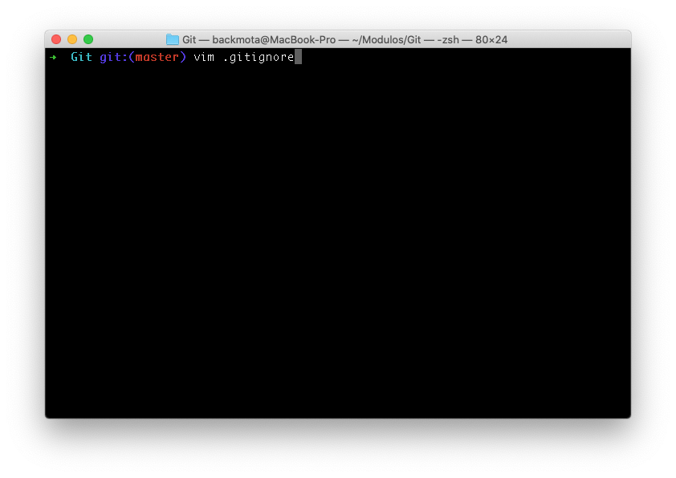
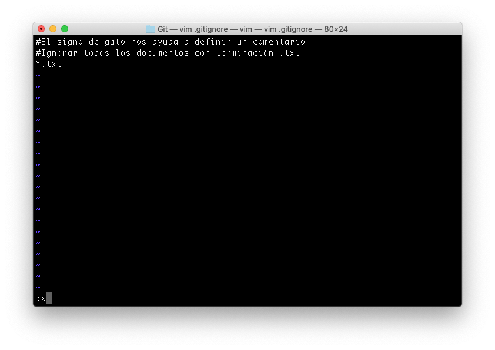

Con el comando `ls -a` podremos visualizar que el archivo fue creado correctamente, procederemos a agregar el archivo al repositorio con `git add` y `git commit`
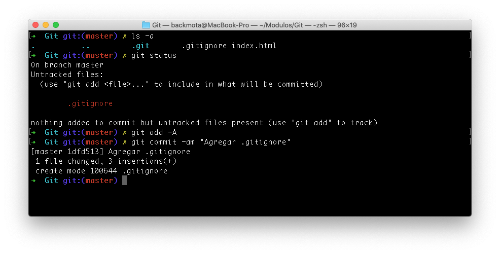
El archivo .gitignore puede considerar las siguientes reglas:

- Ignorar las líneas en blanco y aquellas que comiencen con #.
- Aceptar patrones glob estándar *.
- Los patrones pueden terminar en barra (/) para especificar un directorio.
- Los patrones pueden negarse si se añade al principio el signo de exclamación (!).

Algunos ejemplos de un archivo .gitignore:  

```
# ignora los archivos terminados en .a
*.a


# pero no lib.a, aun cuando había ignorado los archivos terminados en .a
!lib.a


# ignora únicamente el archivo TODO de la raíz, no subdir/TODO
/TODO


# ignora todos los archivos del directorio build/
build/


# ignora doc/notes.txt, pero no este: doc/server/arch.txt
doc/*.txt
```
En GitHub se podrá encontrar una extensa lista de archivos .gitignore adecuados a docenas de proyectos y lenguajes en [https://github.com/github/gitignore](https://github.com/github/gitignore.).

Realizaremos una prueba para comprobar que el archivo .gitignore está funcionando correctamente, por lo que procederemos a crear un archivo .txt con el comando `vim prueba.txt` , agregaremos un texto y guardaremos el cambio. Una vez creado el archivo revisaremos con el comando `ls` que fue creado correctamente y al usar el comando `git status` notaremos que no hay ningún archivo nuevo que agregar al repositorio, esto significa que el archivo fue ignorado por el rastreador.
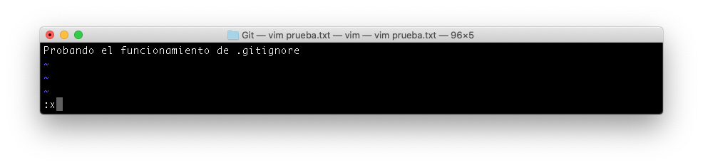
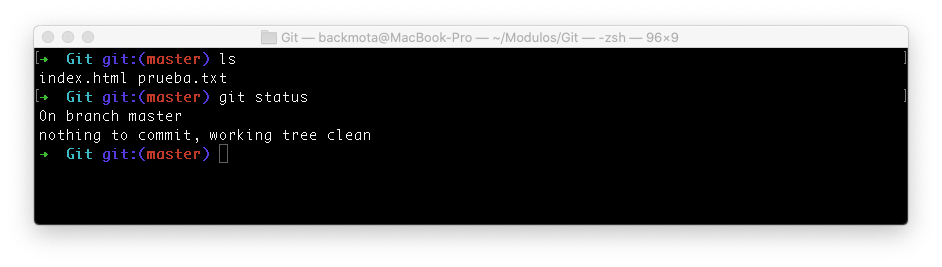
En el siguiente [Link](https://www.youtube.com/watch?v=24td-L6MHmY) podrás encontrar un video tutorial para repasar el uso de .gitignore.

### **Deshacer Cosas**


En diversas situaciones tendrás la necesidad de deshacer algo. Aquí comprenderemos el uso de las herramientas básicas usadas para deshacer cambios que hayas realizado, pero debes tener cuidado, ya que en ocasiones no es posible recuperar algo luego que lo has deshecho. Este es de las pocas áreas en las que  Git puede perder parte de tu trabajo si cometes un error.

Una de las acciones más comunes a deshacer es cuando confirmas un cambio antes de tiempo y olvidas agregar algún archivo, o te equivocas en el mensaje de confirmación, en estos casos usaremos el comando [--amend (Video Tutorial)](https://www.youtube.com/watch?v=9AkcsMpKYhI&list=PLTd5ehIj0goMCnj6V5NdzSIHBgrIXckGU&index=5)

Trabajaremos con **vim** nuestro archivo **index.html**, lo guardaremos (**esc** + **:x**)

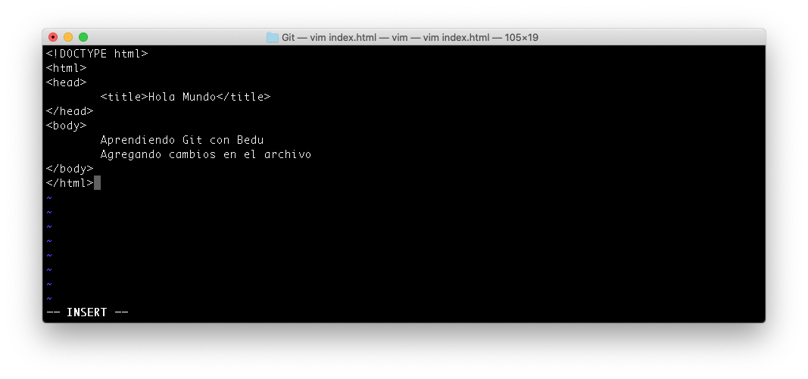
Realizaremos un commit pero para uso práctico del ejemplo vamos a escribir mal el mensaje del commit: `git commit -am “Adtualizando index.html”`
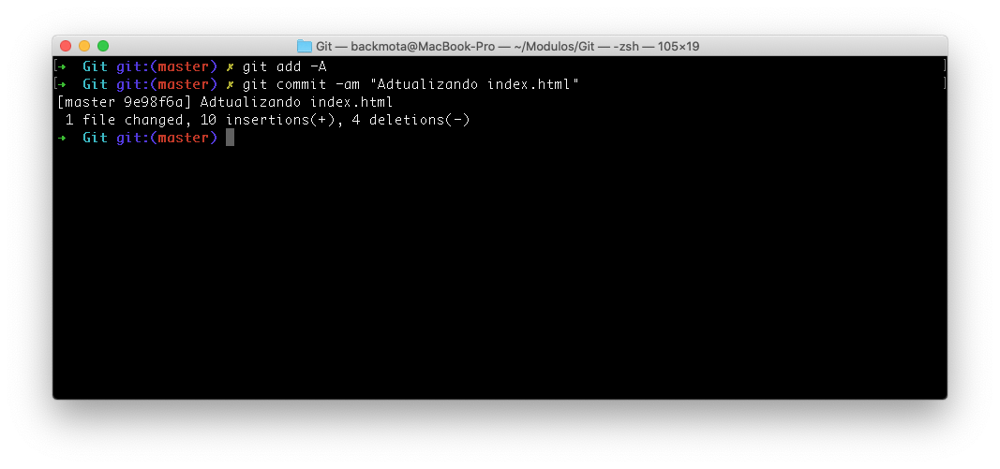
Una vez realizado el commit para corregir nuestro error usaremos el comando `git commit --amend -m “Actualizando index.html”` (Es importante recordar que el comando `--amend` solo funciona con el último commit realizado”.
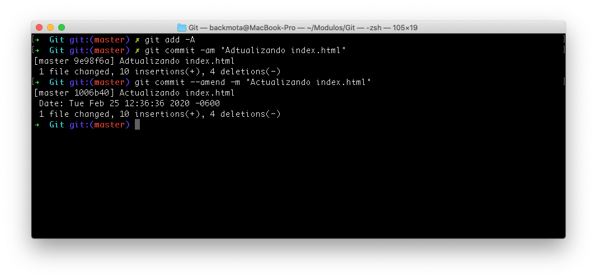
Con el comando `git log` podremos observar que el último commit quedó registrado con el mensaje correcto.
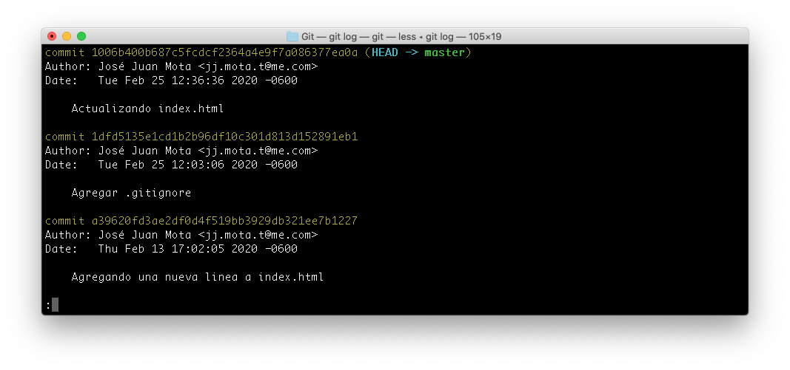
### Eliminar Archivos

En Git es posible eliminar archivos rastreados o mejor dicho eliminar del área de preparación, para esta acción existe el comando `git rm`, que además elimina el archivo del directorio de trabajo, esta propiedad existe por seguridad y puede ser particularmente útil si olvidaste añadir algo en el archivo .gitignore y lo preparaste de forma accidental.

Crearemos un archivo llamado texto con `vim texto`
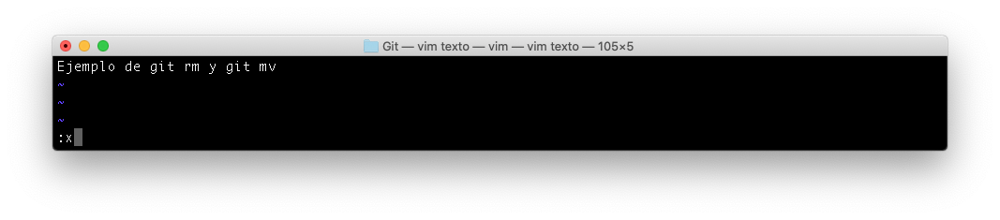
 Una vez creado revisaremos con `git status` los archivos que hacen falta agregar a nuestra área de preparación, agregaremos el archivo con `git add -A`, volveremos a revisar el estado del área de preparación con `git status`.
 
 
Ahora si buscamos quitar el archivo texto del área de preparación usaremos el comando `git rm --cached texto` y revisaremos el estado con el comando `git status` (Notaremos que el archivo texto se encuentra en rojo nuevamente).
 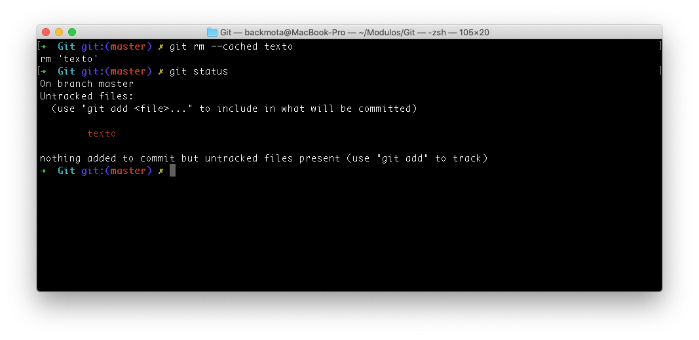
 
### Renombrar archivos

A diferencia de otros sistemas de [VCS](https://es.wikipedia.org/wiki/Control_de_versiones), Git no rastrea explícitamente los cambios de nombre en archivos, Si renombramos un archivo en Git no se guardará ningún metadato que indique renombramos el archivo, para esto podemos usar el comando `git mv`

Realizaremos un commit de nuestro archivo texto
 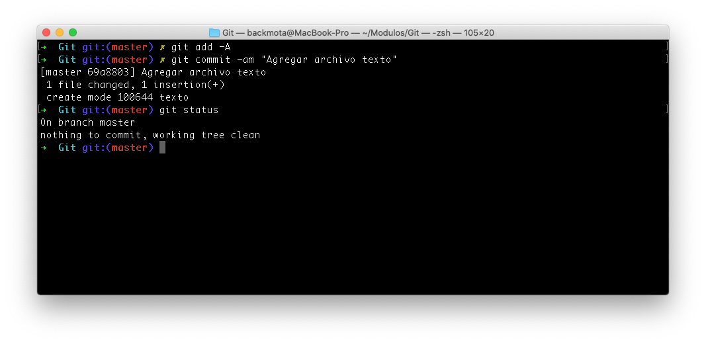
 
Agregaremos la terminación **.txt** con el comando `git mv texto texto.txt` y revisaremos los cambios con `git status`.

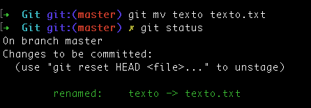

Realizamos un commit, donde la consola nos dará el resultado que cambió un 1 archivo.
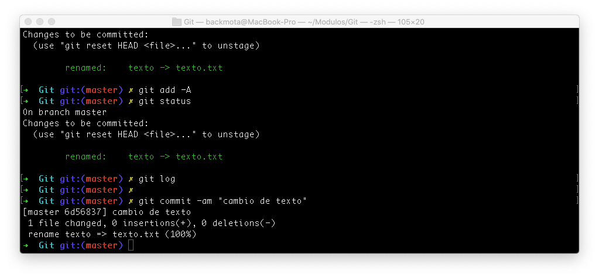

Si en lugar de usar el comando `git mv `cambiáramos el nombre del archivo directo del administrador de archivos de nuestro sistema operativo tendríamos como resultado una eliminación de archivo (texto) y un archivo nuevo (texto.txt) o lo que sería equivalente a usar 3 comandos:

```
mv texto texto.txt

git rm texto

git add texto.txt
```
El siguiente [link](https://www.youtube.com/watch?v=6-XEXsyxFIY) contiene un video de repaso de los comando **amend/rm/mv**

### Uso de ramas en Git

Todos los sistemas de control de versiones modernos tienen algún mecanismo para soportar el uso de ramas. Cuando creamos un repositorio automáticamente creamos la primera rama conocida como **master**.

Para comprender [qué es una rama y cómo trabajan (video tutorial)](https://www.youtube.com/watch?v=rmO7t35l1XI&list=PLTd5ehIj0goMCnj6V5NdzSIHBgrIXckGU&index=8),debemos recordar la forma en que git almacena los datos. Recordando lo citado - [Sobre el Control de Versiones](https://git-scm.com/book/es/v2/Inicio---Sobre-el-Control-de-Versiones-Acerca-del-Control-de-Versiones#ch01-introduction), Git no los almacena de forma incremental (guardando sólo diferencias), sino que los almacena como una serie de instantáneas (copias puntuales de los archivos completos, tal y como se encuentran en ese momento).

Para ilustrar esto, vamos a suponer, por ejemplo, que tienes una carpeta con tres archivos, que preparas (stage) todos ellos y los confirmas (commit). Cuando creas una confirmación con el comando git commit, Git realiza sumas de control de cada subdirectorio (en el ejemplo, solamente tenemos el directorio principal del proyecto), y las guarda como objetos árbol en el repositorio Git.
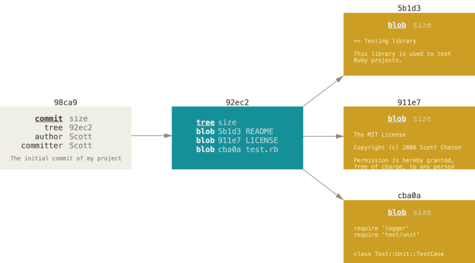

Si seguimos realizando cambios y commits, todos estos cambios quedarán guardados en el repositorio de manera secuencial.
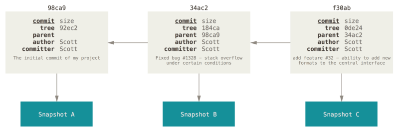

En cambio el uso de ramas nos permite trabajar proyectos de forma paralela, en la que podemos tener diferentes versiones sin alterar una versión anterior y posteriormente fusionar ramas para mantener una versión unificada.
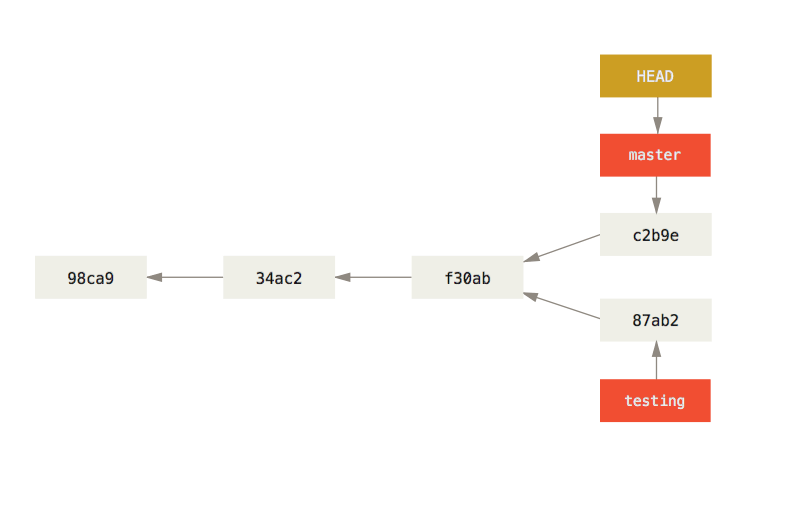

### Crear una nueva Rama

¿Qué sucede cuandos creas una nueva rama? Simplemente se creará una copia paralela de la rama actual en la que nos encontremos.

Podemos revisar las ramas existentes de nuestro repositorio con el comando `git branch` y nos indicará en qué rama nos encontramos. (En este caso solo tendremos la rama inicial master)
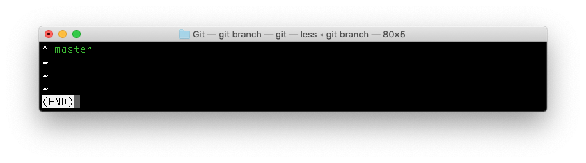

Para crear una nueva rama usaremos nuevamente el comando `git branch` añadiendo el nombre para denominar la rama a crear; por ejemplo: `git branch testing`, con el comando git branch observaremos que ahora contamos con dos ramas, pero el apuntador nos sigue posicionando sobre la rama master.

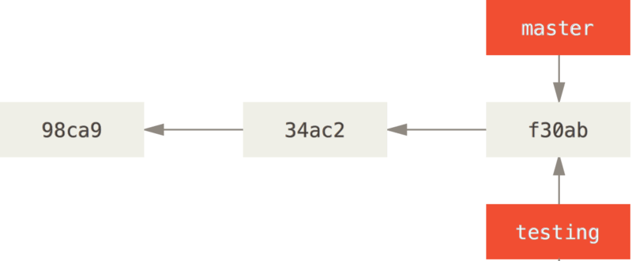

### Cambiar de Rama

Para pasar de una rama a otra, utilizaremos el comando `git checkout`. Realizaremos una prueba con `git checkout testing` para saltar a la rama testing recién creada
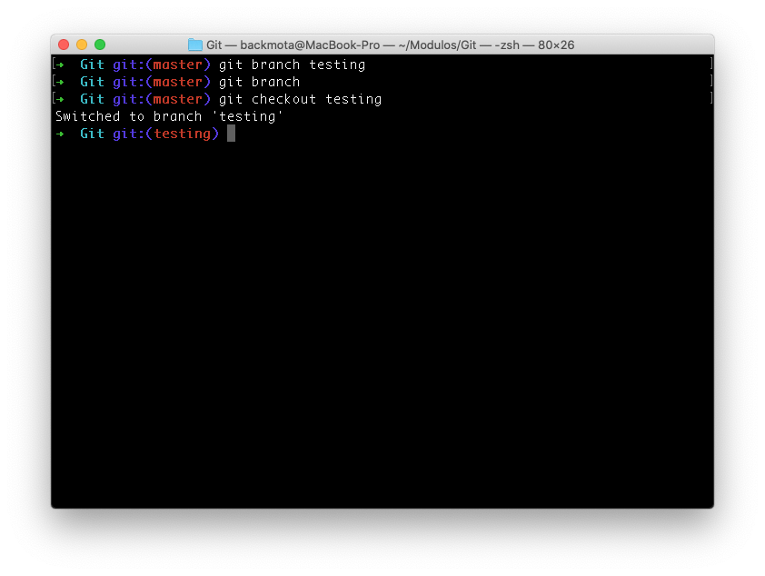

Revisaremos Con el comando git branch que el apuntador indicará que nos encontramos en la rama testing en lugar de master.
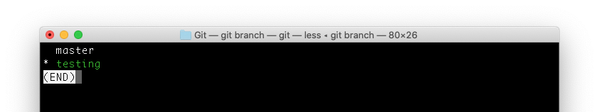
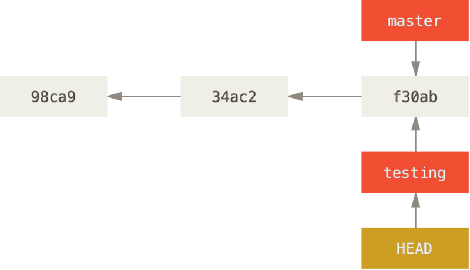

A partir de este momento podemos seguir trabajando en nuestro proyecto, sin modificar el estado actual de los archivos en la rama master.

Realizaremos algunos cambios en el archivo index.html con `vim index.html`
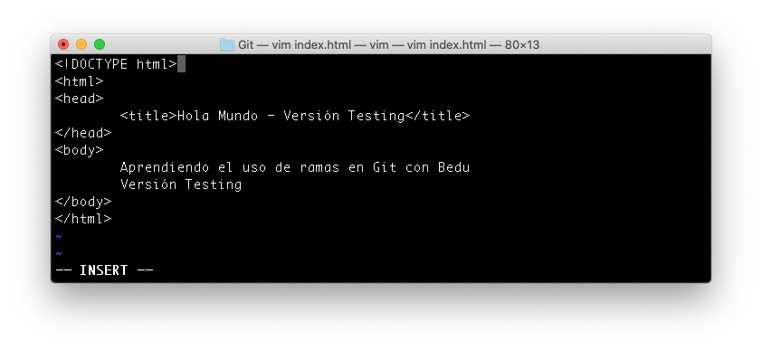

Una vez realizado los cambios realizaremos un commit:

```
git add -A

git commit -am “Trabajando en la rama testing”
```
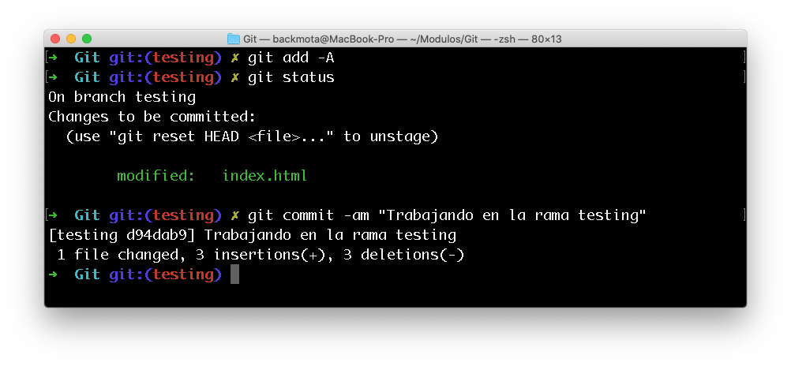

A partir de este momento el historial de cambios serán de manera divergente, al usar el comando `git log --oneline --decorate --graph --all` podremos observar en qué rama se realizó la confirmación.
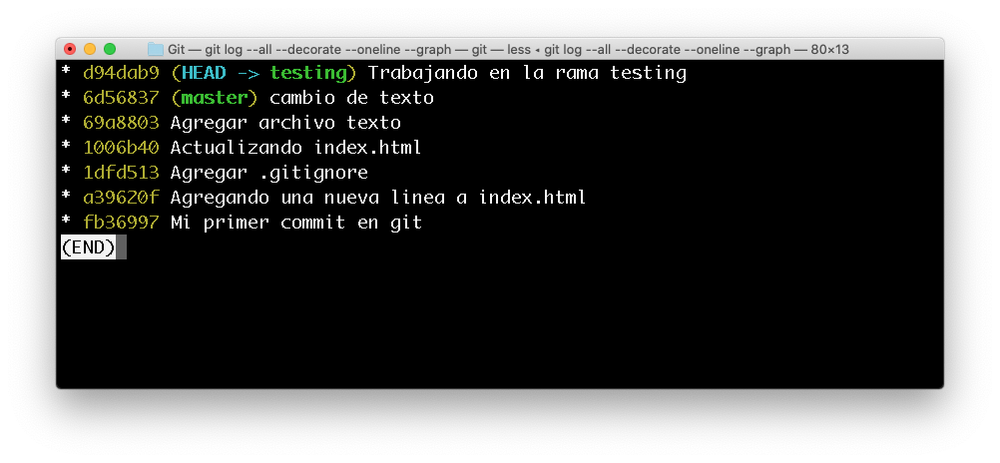

Regresaremos a la rama master con el comando `git checkout master`

Revisaremos el archivo index.html con el comando `cat index.html` y notaremos que el archivo index.html se encuentra en el estado original en el que estábamos trabajando antes de crear las rama testing.
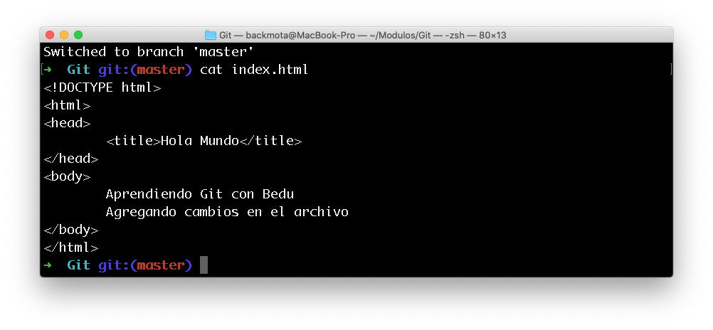

Crearemos un segundo archivo llamado bedu.html con el comando `vim bedu.html`
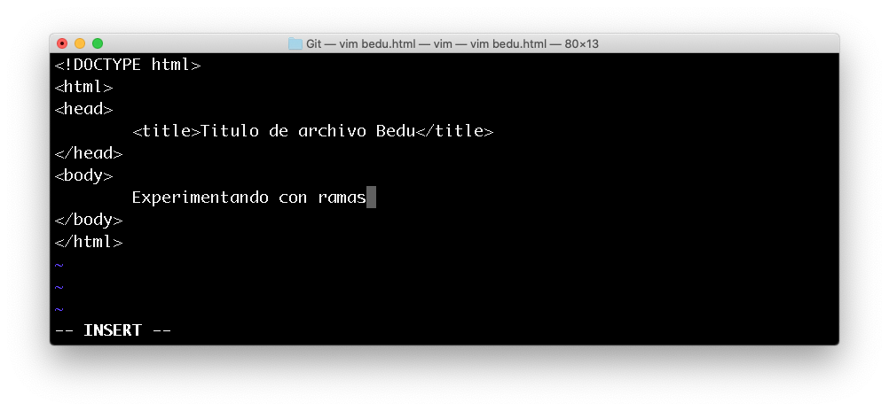

Crearemos un commit en nuestro repositorio con los comando `git add -A` y `git commit -am “Agregando archivo Bedu.html en rama master”`
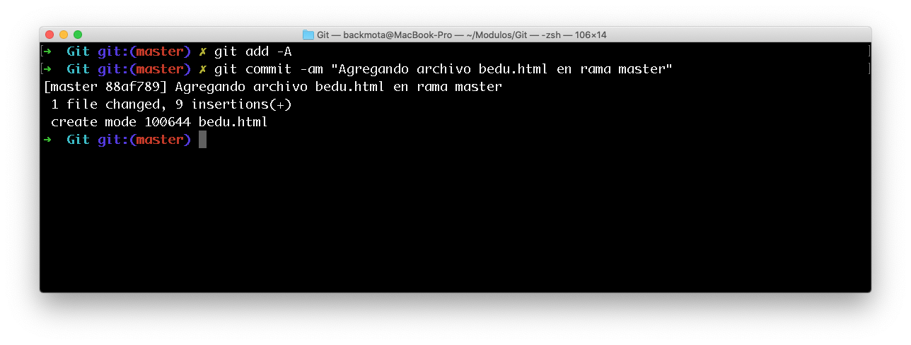

Usaremos el comando `git log --oneline --decorate --graph --all` donde podremos observar de forma gráfica cómo se dividen las dos ramas en las que estamos trabajando, mostrando que existe una diferencia entre la rama master y la rama testing.
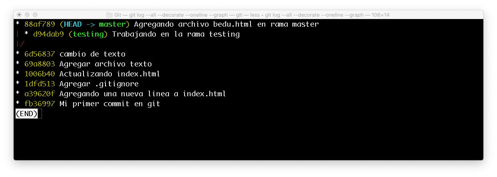

### Procedimientos Básicos de Fusión

En el caso que queramos unificar los cambios realizados en una rama en otra, tendremos que realizar un proceso llamado fusionar (merge), antes de realizar dichos pasos revisaremos nuevamente el estado actual del archivo index.html con `cat index.html` en la rama master.
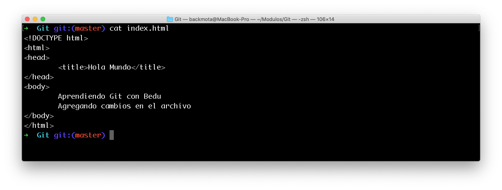

Para realizar una fusión es necesario posicionarnos en la rama en la que deseamos agregar los cambios de otra rama, en este caso nos ubicamos en la rama master y utilizaremos el comando `git merge testing` para fusionar los archivos con cambios entre ambas ramas, nos mostrará un mensaje si queremos especificar el motivo del commit, usaremos las teclas esc seguido por **:q** para salir de esta ventana.
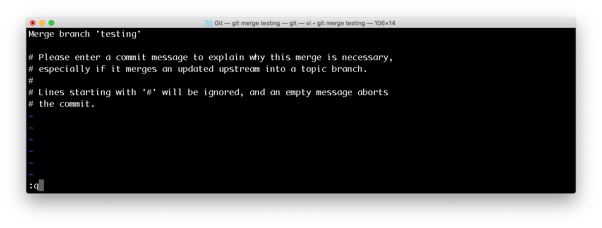
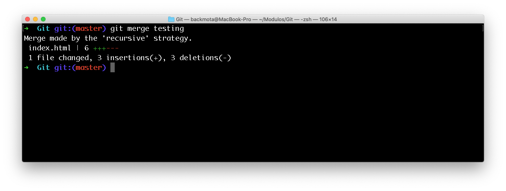
Con el comando `git log --all --decorate --oneline --graph` podremos observar de manera gráfica cómo se encuentra fusionada ambas ramas en master, teniendo como último commit el merge.
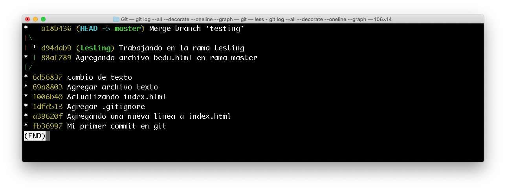
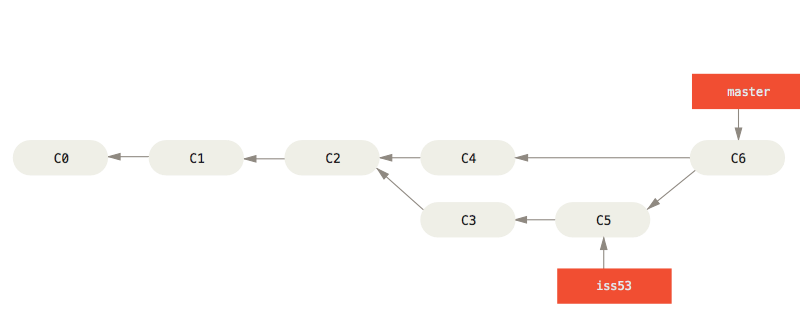
Revisaremos el archivo **index.html** con `cat index.html` y observaremos como los cambios realizados en la rama testing ahora se encuentran reflejados en la rama master.
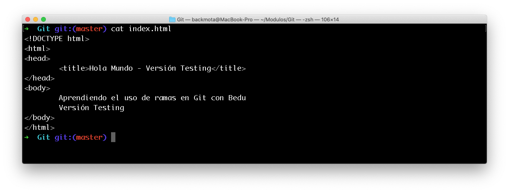
Cambiaremos a la rama testing con el comando `git checkout testing` y al usar el comando ls encontraremos que el archivo bedu.html en la rama master no existe en esta versión.
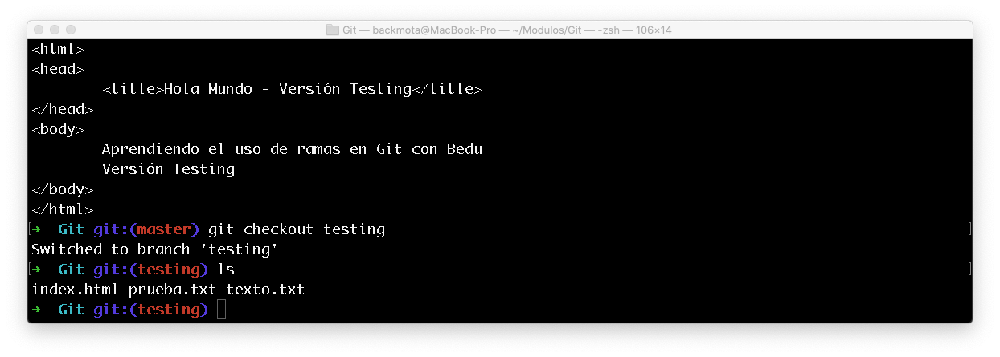
Usaremos el comando `git log --all --decorate --oneline --graph`, observaremos que el apuntador Head se encuentra en un punto más atrás de la rama master y antes del merge, podemos realizar un merge de la rama master para situar ambas ramas en una versión similar de forma paralela.
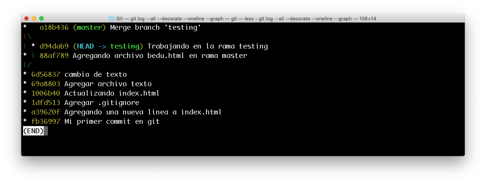
Utilizaremos el comando `git merge master` en el cual git nos notificara el cambio de un archivo, que en este caso se trata de la creación del archivo bedu.html dentro de la rama testing.
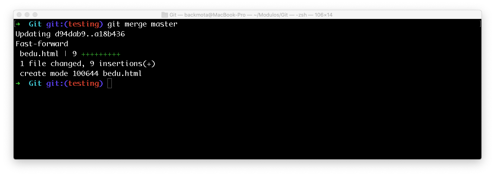
Con el comando `git log --all --decorate --oneline --graph` observaremos que ambas ramas se encuentran en un mismo punto en este momento, por lo que convergen ambas ramas.
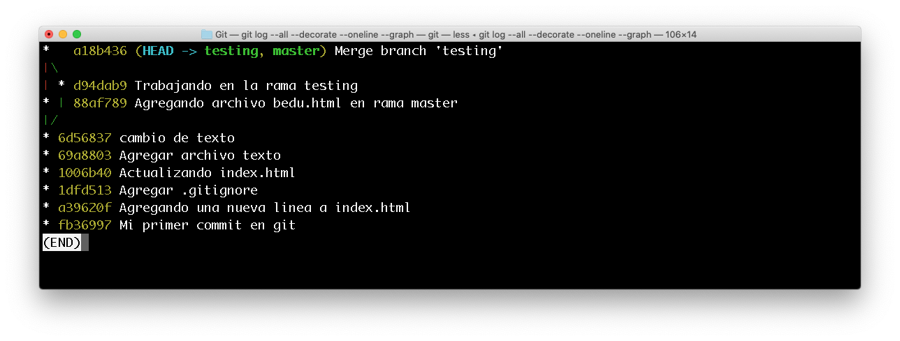

### Renombrar Ramas

En algunas ocasiones será necesario cambiar el nombre de una rama, sobre todo para mantener una buena organización.

Crearemos una nueva rama partiendo de la rama testing con el comando `git branch testing2` seguido por el comando `git branch` para visualizar las ramas existentes que para este momento deberán ser 3.
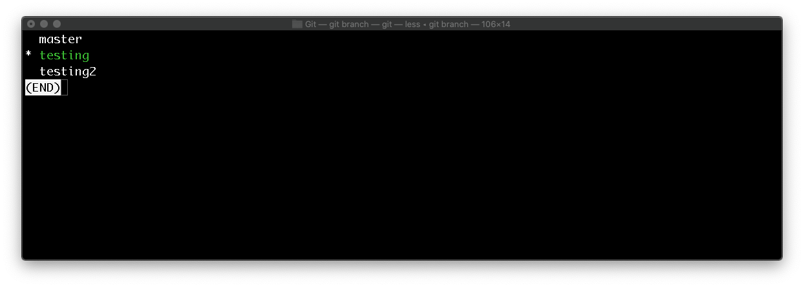
Usar números en los nombres es una mala práctica, ya que cuando tengamos un número significativos de ramas sería difícil identificar que contiene cada una, por lo cual procederemos a cambiar de nombre la rama **testing2** con el comando `git branch -m [nombre de la rama] [nuevo nombre de la rama]`

Por lo que usamos `git branch -m testing2 new-feature` seguido por el comando `git branch` para ver el cambio efectuado.
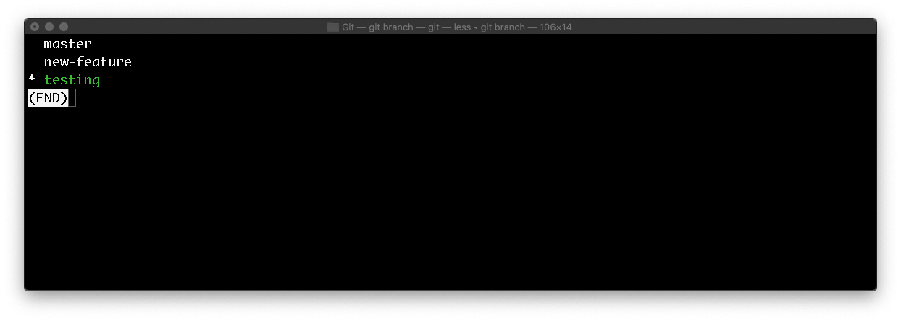

### Eliminación de Ramas

En muchas ocasiones para mantener una buena organización de ramas, será necesario borrar las ramas que no vayamos a utilizar nuevamente o que solo creamos para realizar pruebas.

Desplegamos las ramas existentes con el comando `git branch`


En este caso vamos a borrar la rama **new-feature** para borrar una rama debemos usar el comando `git branch -d [nombre de la rama]`

Procederemos a borrar la rama con el comando `git branch -d new-feature`
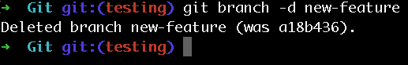

Desplegamos las ramas existentes con el comando `git branch`, donde visualizamos únicamente dos ramas.
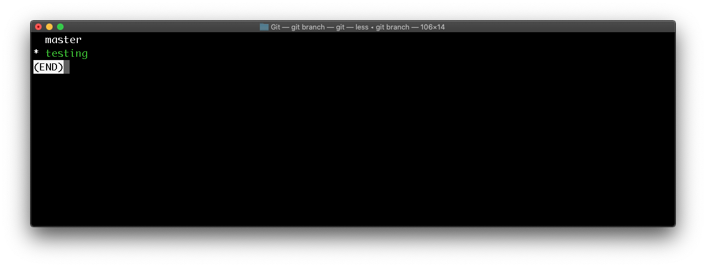

En el siguiente [link](https://www.youtube.com/watch?v=j0U9jBmP3LM&list=PLTd5ehIj0goMCnj6V5NdzSIHBgrIXckGU&index=9) podrás encontrar un video tutorial resumiendo cómo crear, modificar y eliminar ramas.

### Git Flow

Ahora que ya has visto los procedimientos básicos de ramificación y fusión, ¿qué puedes o qué debes hacer con ellos? En este apartado vamos a ver algunos de los [flujos de trabajo más comunes](https://www.youtube.com/watch?v=LUaJ2989qpI), de tal forma que puedas decidir si te gustaría incorporar alguno de ellos a tu ciclo de desarrollo.

**Ramas de Largo Recorrido**

Por la sencillez de la fusión a tres bandas de Git, el fusionar una rama a otra varias veces a lo largo del tiempo es fácil de hacer. Esto te posibilita tener varias ramas siempre abiertas, e irlas usando en diferentes etapas del ciclo de desarrollo; realizando fusiones frecuentes entre ellas.

- Master
- Develop
- Topic
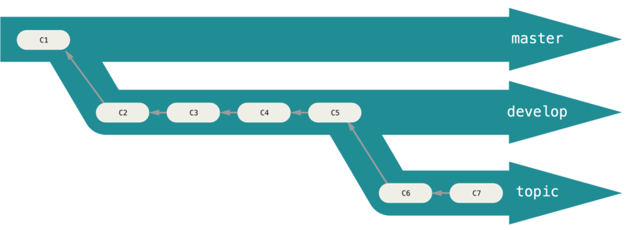

**Ramas Puntuales**

Las ramas puntuales, en cambio, son útiles en proyectos de cualquier tamaño. Una rama puntual es aquella rama de corta duración que abres para un tema o para una funcionalidad determinada. Es algo que nunca habrías hecho en otro sistema VCS, debido a los altos costos de crear y fusionar ramas en esos sistemas. Pero en Git, por el contrario, es muy habitual el crear, trabajar con, fusionar y eliminar ramas varias veces al día.
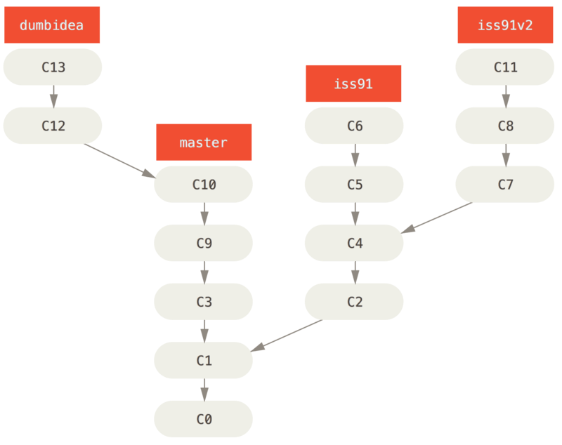

### Principales Conflictos que Pueden Surgir en las Fusiones

En algunas ocasiones, los procesos de fusión no suelen ser fluidos. Si hay modificaciones dispares en una misma porción de un mismo archivo en las dos ramas distintas que pretenden fusionar, Git no será capaz de fusionarlas directamente. Por ejemplo: si en el mismo archivo se trabajó sobre la misma línea, por lo [que verás un conflicto como este (Video tutorial)](https://www.youtube.com/watch?v=3-rCELg8feQ&list=PLTd5ehIj0goMCnj6V5NdzSIHBgrIXckGU&index=12):

```
Auto-merging index.html

CONFLICT (content): Merge conflict in index.html

Automatic merge failed; fix conflicts and then commit the result.
```

Para crear un conflicto modificaremos el Head de index.html en ambas ramas y creando un commit de ambas antes de intentar fusionar,  comenzaremos con index.html de la rama testing con el comando `vim index.html` y realizaremos el commit correspondiente con `git add -A` + `git commit -am “Generando Conflicto testing”`
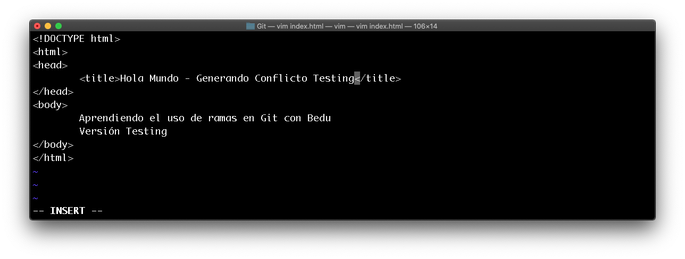
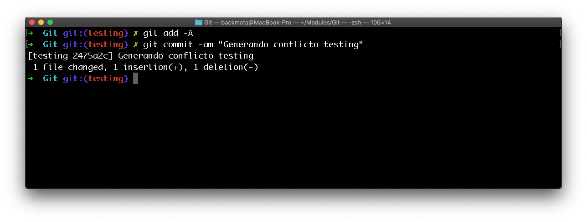

Cambiaremos a la branch master con `git checkout master`
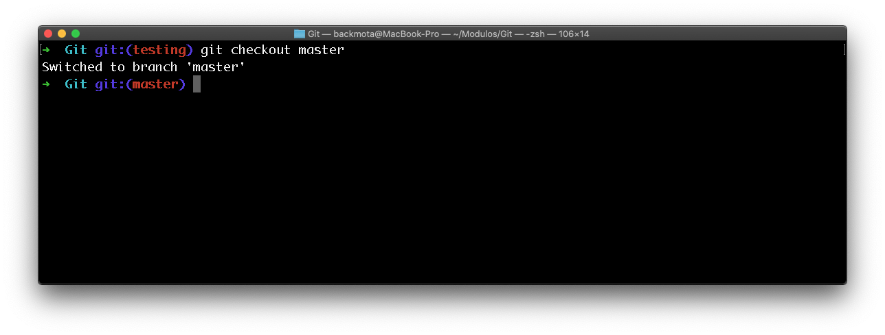

Realizaremos cambios en  **index.html** de la rama master con el comando vim index.html y realizaremos el commit correspondiente con `git add -A` + `git commit -am “Generando Conflicto en master”`
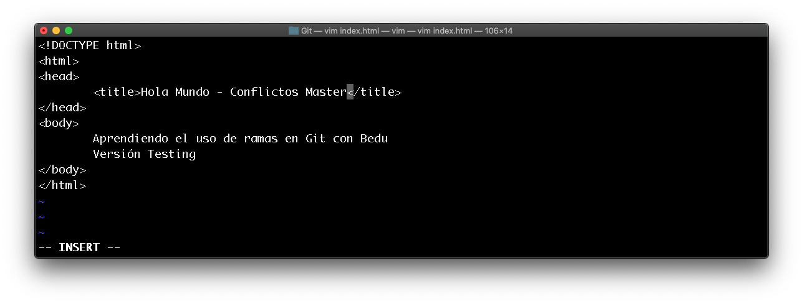
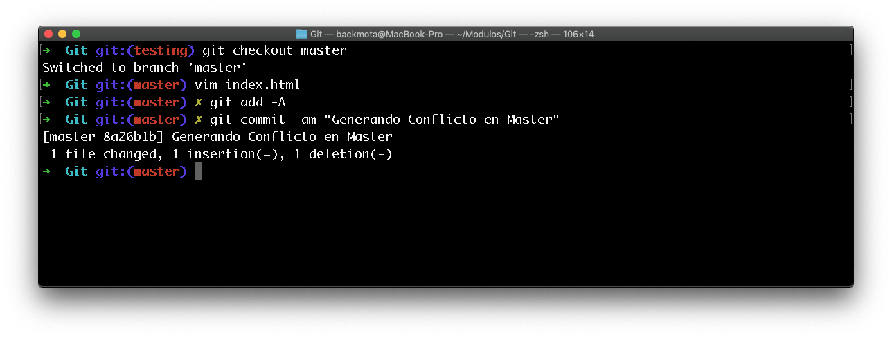
Ejecutaremos el comando `git log --all --decorate --oneline --graph` y observaremos que ambas ramas se encuentran divergentes.
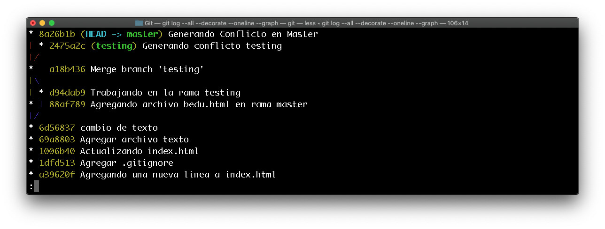
A continuación intentaremos realizar el merge con la rama testing con el comando `git merge testing`, pero nos indicará que existe un conflicto entre ambas ramas.
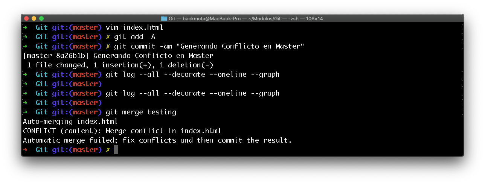
Git no crea automáticamente una nueva fusión confirmada **(merge commit)**, sino que hace una pausa en el proceso, esperando a que tú resuelvas el conflicto. Para ver qué archivos permanecen sin fusionar en un determinado momento conflictivo de una fusión, puedes usar el comando `git status`:
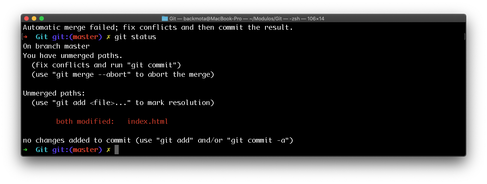
Todo aquello que sea conflictivo y no se haya podido resolver, se marca como "sin fusionar" **(unmerged)**. Git añade a los archivos conflictivos unos marcadores especiales de resolución de conflictos que te guiarán cuando abras manualmente los archivos implicados y los edites para corregirlos. Revisaremos el archivo con conflicto con `vim index.html` (Veremos ambas versiones del titulo)
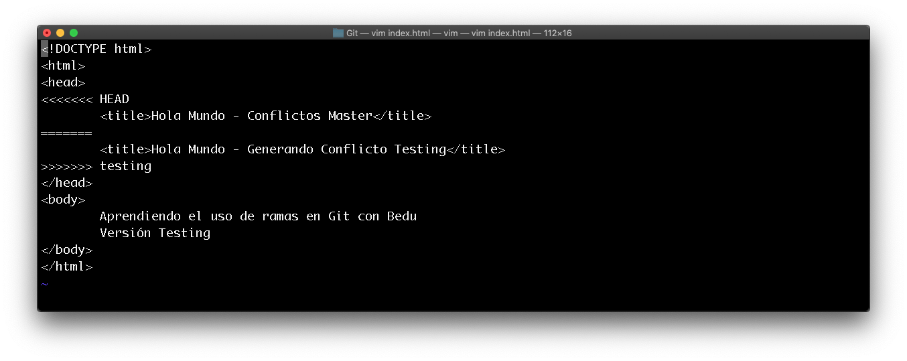
Donde nos dice que la versión en **HEAD** (la rama **master**, la que habías activado antes de lanzar el comando de fusión) contiene lo indicado en la parte superior del bloque (todo lo que está encima de =======) y que la versión en **testing** contiene el resto, lo indicado en la parte inferior del bloque. Para resolver el conflicto, has de elegir manualmente el contenido de uno o de otro lado. Por ejemplo, puedes optar por cambiar el bloque, dejándolo así:
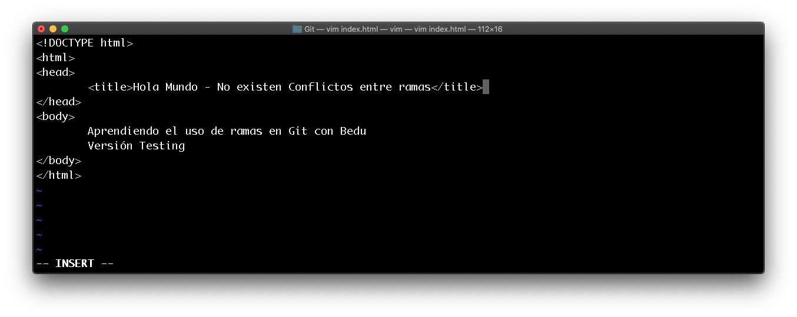
Esta corrección contiene un poco de ambas partes y se han eliminado completamente las líneas <<<<<<< , ======= y >>>>>>>. Tras resolver todos los bloques conflictivos, has de lanzar comandos `git add -A` para marcar cada archivo modificado. Marcar archivos como preparados (`git status`) indica a Git que sus conflictos han sido resueltos.
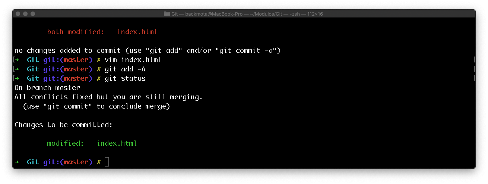
Realizaremos confirmaremos los cambios con `git commit -am “Merge: Fix”` y revisaremos la estructura de las ramas con `git log --all --decorate --oneline --graph
`


