# Sesión 3: Servicios Distribuidos (GitLab y GitHub)

### **Objetivo:**

Configurar Git con servicios distribuidos (Github y Gitlab), creación de llaves ssh y hacer uso de los comando push y pull de forma correcta

### Instrucciones:

Leer y analizar los recursos listados a continuación.Se recomienda ver el video indicado por cada enlace.

### Git Remoto

La creación de repositorios, commits y ramas son suficientes para las tareas diarias que estarás efectuando con Git, sin embargo para poder trabajar de manera colaborativa o mantener una copia de seguridad del repositorio será necesario configurar Git para trabajarlo de forma remota, que se basa técnicamente en que puedas  enviar y recibir información de otros equipos.


Los métodos más comunes para trabajar de forma remota son el de enviar **(push)** y recibir **(pull)**.


Configurar Git con un servidor es un proceso bastante sencillo, pero primero es necesario elegir con qué [protocolo ](https://es.wikipedia.org/wiki/Protocolo_de_internet)se comunica el servidor.

Git cuenta con cuatro protocolos, Local, [HTTP](https://es.wikipedia.org/wiki/Protocolo_de_transferencia_de_hipertexto), [Secure Shell (SSH)](https://es.wikipedia.org/wiki/Secure_Shell) y Git.

El protocolo SSH es el protocolo más habitual y seguro para alojar repositorios Git en Hostings como es el caso de [Github](https://es.wikipedia.org/wiki/GitHub) y [Gitlab](https://es.wikipedia.org/wiki/GitLab).

Para hacer uso del protocolo SSH con otros servicios primero debemos [crear una Clave SSH (video tutorial).](https://www.youtube.com/watch?v=j-zmv-ITQb8)

El primer paso para crear nuestra clave será abrir nuestra terminal o git bash e introducir el siguiente comando `ssh-keygen`

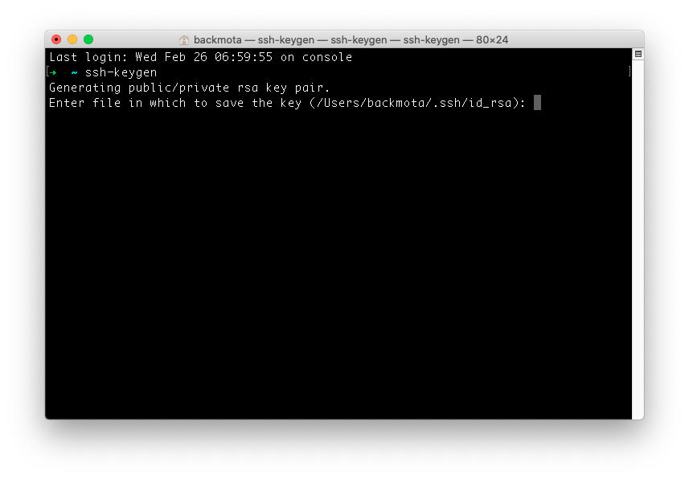

Si es la primera vez que creamos una Clave SSH no será necesario poner algún nombre (solo debemos oprimir enter hasta el final del proceso), ya que por defecto nos va crear dos claves una privada y una pública (debemos tener cuidado de nunca compartir la llave privada ya que cualquier persona podría tomar control de nuestra computadora), en el caso de contar ya con una clave ssh podemos usar la llave pública existente o crear una nueva con un nombre en especifico, una vez terminado el proceso veremos algo similar a la siguiente pantalla.

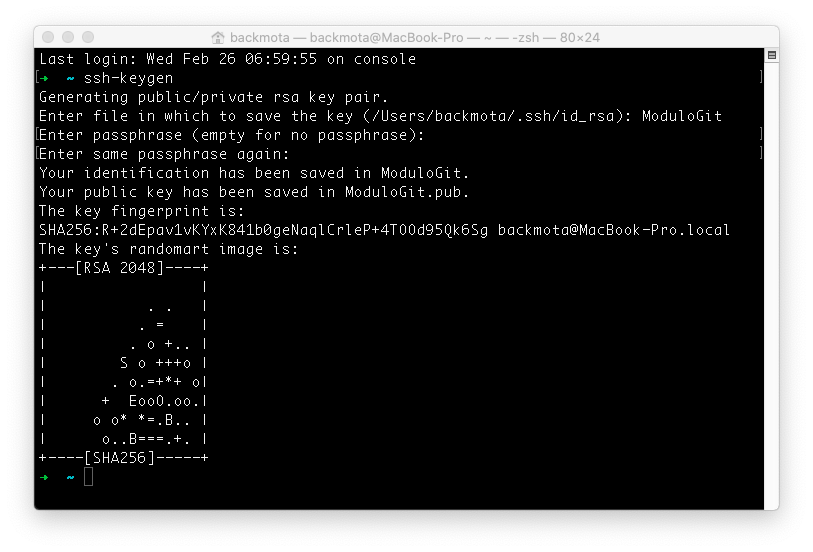

Una vez creado nos dirigimos al directorio **/.ssh** por medio del comando `cd /.ssh` y desplegamos el lista de llaves públicas con `ls`

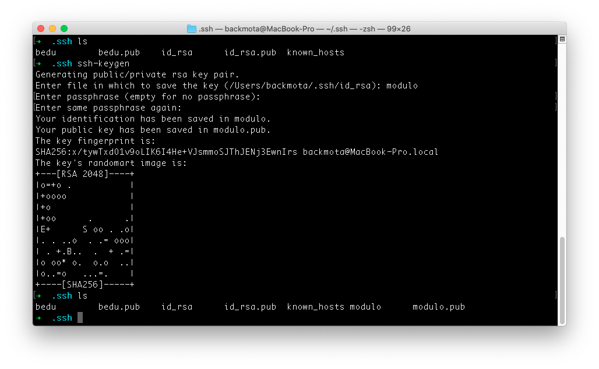

Las llaves públicas son las que contienen la terminación **.pub** y son las únicas que debemos utilizar para configurar nuestros servidores remotos, a continuación deberemos crear una cuenta en un hosting (También podemos crear [nuestro propio servidor Git](https://git-scm.com/book/es/v2/Git-en-el-Servidor-Configurando-el-servidor)), en este caso vamos a crear una cuenta en Gitlab y otra en Github.

### GitLab

Gitlab es un servicio web de control de versiones basado en Git, a diferencia de Github es un sistema de [código abierto](https://es.wikipedia.org/wiki/Licencia_de_c%C3%B3digo_abierto).

Lo primero que debes realizar es crear una cuenta en [gitlab.com](https://gitlab.com/users/sign_in) , podemos registrarnos con nuestro correo o con alguna red social como es el caso de Twitter, Github o nuestra cuenta de Gmail.

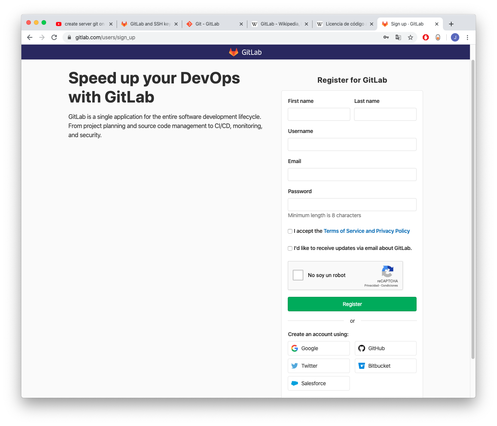

#### Una vez creada nuestra cuenta realizamos login y nos dirigimos a la parte superior derecha donde se encuentra nuestro usuario.  


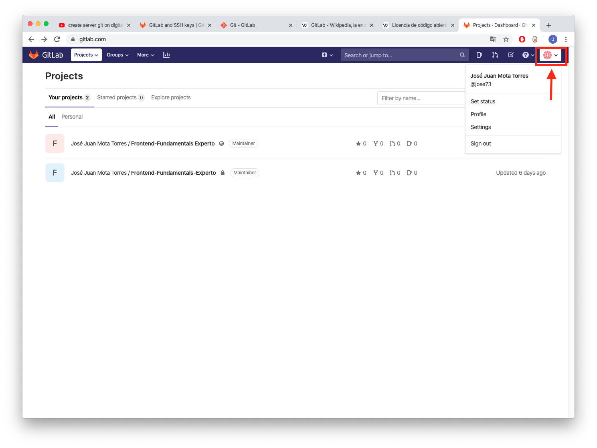  


#### Se desplegará un menú y seleccionamos la opción de Settings, que nos mostrara lo siguiente:

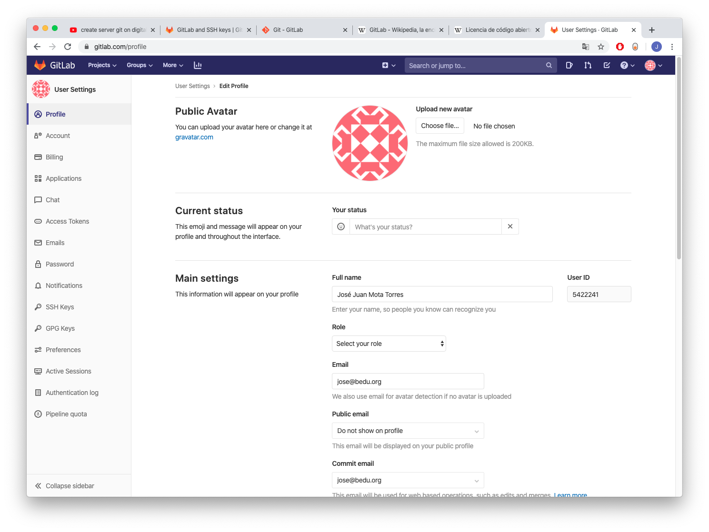
  
  
#### En el menú de lado izquierdo seleccionaremos la opción de SSH Keys.  

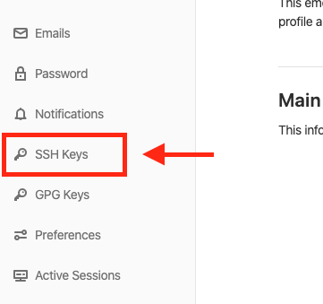
 
#### Una vez realizado el click mostrará lo siguiente:

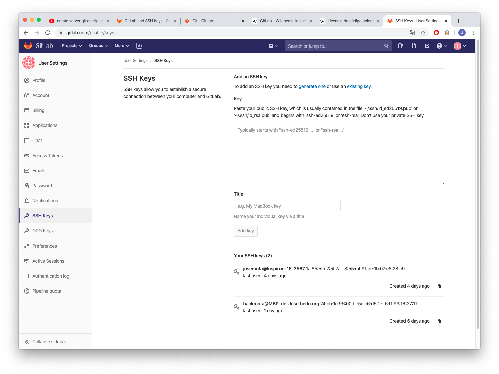  


Abriremos de nuevo nuestra terminal y accedemos nuevamente a la carpeta **.ssh** por medio de `cd .ssh`, desplegamos el lista de claves con `ls` y seleccionaremos la clave pública a desplegar con **cat [nombre de la clave].pub** , en este caso sería  `cat id_rsa.pub` o `cat modulo.pub`, una vez desplegada la clave la copiaremos en nuestro portapapeles.

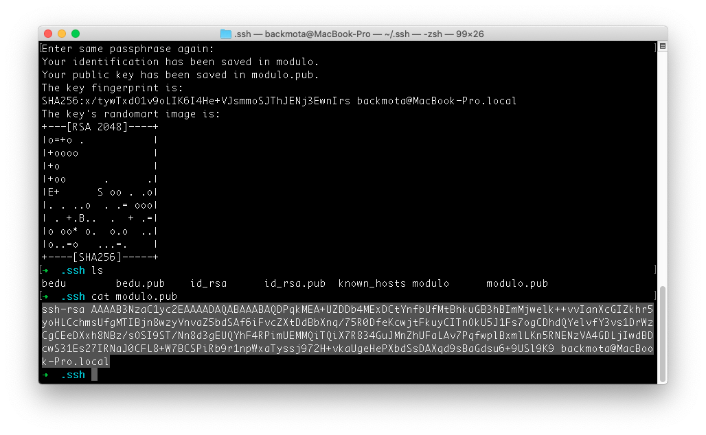


Regresaremos a la ventana donde tenemos abierto gitlab.com en nuestro navegador y en el apartado donde pide ingresos la ssh que acabamos de copiar la pegaremos, en un apartado inferior nos pide que ingresemos un nombre con el cual identificamos dicha clave (Por defecto nos agrega un nombre, pero podemos cambiarlo), para finalizar el proceso realizamos click en el botón **Add Key**.

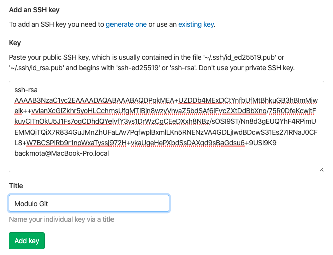

#### Gitlab mostrará la siguiente pantalla:

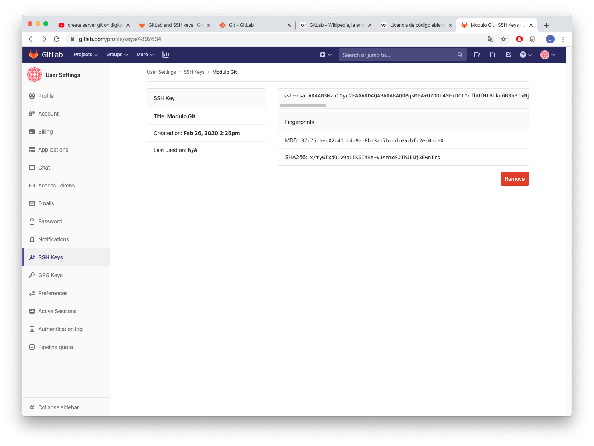

Procederemos a crear nuestro repositorio remoto, seleccionando el apartado **Projects** en el menú superior izquierdo, seguido por la opción **YourProjects**

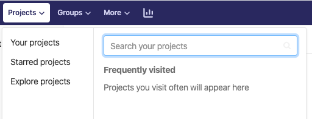

Realizamos click en el botón  **New Project** ubicado en el lado superior derecho.


Nos desplegará una pantalla donde podremos introducir el nombre del proyecto, una descripción y seleccionar si queremos que nuestro repositorio sea público (cualquiera con la dirección url puede ver nuestro proyecto) o privado (esta opción es de paga en gitlab.com pero nos permite gestionar quién tiene acceso al proyecto. en el caso de montar nuestro propio servidor o usar la version de gitlab en nuestro propio servidor esta opción no necesita pago), seleccionaremos la casilla que indica que queremos inicializar el [Readme](https://es.wikipedia.org/wiki/README) del proyecto, terminaremos el proceso con el botón verde **Create Project**.

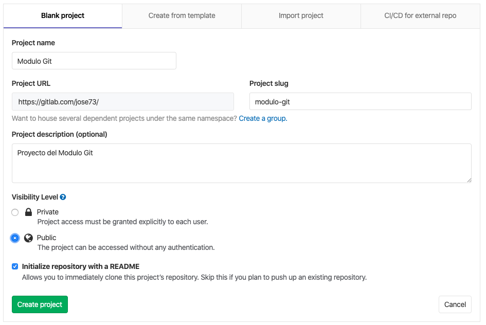

#### Nos mostrará la vista general de nuestro proyecto.

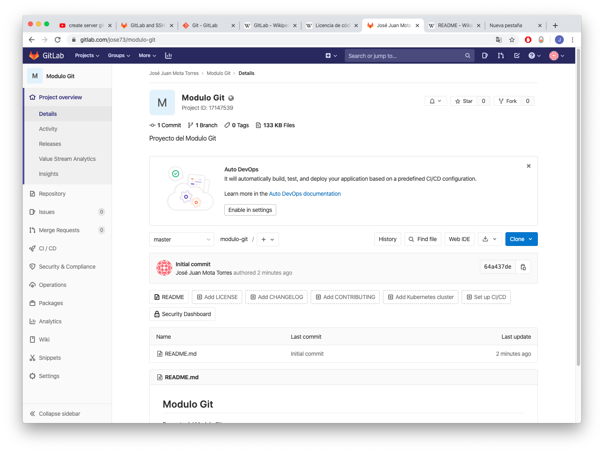

Seleccionaremos el botón de **Clone** de color azul que se encuentra de lado izquierdo y copiaremos la liga con la leyenda **Clone with SSH**.

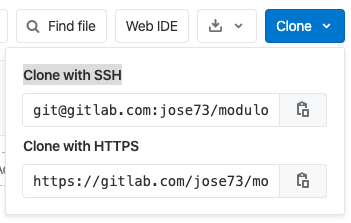

Abrimos nuestra terminal o git bash, e ingresamos a la carpeta donde tenemos nuestro repositorio de **git**, para conectar nuestro repositorio existente con el repositorio remoto en **Gitlab** haremos uso del comando **git remote add origin [url]**; por ejemplo:

`git remote add origin git@gitlab.com:jose73/modulo-git.git`

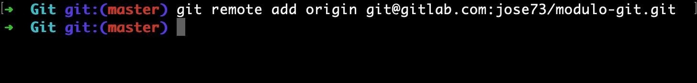

### Git Pull

Ahora que ya tienes un repositorio remoto Git configurado como punto de trabajo para que los desarrolladores compartan su código, y además ya conoces los comandos básicos de Git para usar en local, verás cómo se puede utilizar alguno de los flujos de trabajo distribuido que Git permite.

Uno de los principales comando que utilizaras en el manejo de repositorios distribuidos es el comando **[git pull](https://www.youtube.com/watch?v=ivQbQ5r_03I) (Video tutorial)** esta instrucción lo que nos permite realizar es obtener los cambios realizados en el repositorio remoto, tenemos que tener en cuenta que cuando trabajamos de forma distribuida en muchas ocasiones estaremos trabajando sobre el mismo archivo que otros programadores por lo que siempre será importante descargar dichos cambios para evitar sobreescribir en ellos. Realizaremos **git pull** de nuestro repositorio en gitlab ubicándonos en el directorio de nuestro repositorio local.

Usaremos el comando `git pull origin master` (El uso de origin master solo es necesario la primera ocasión que obtenemos datos del repositorio remoto).

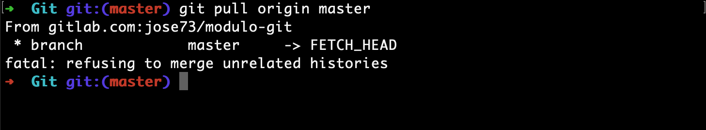

Como puede observar obtuvimos una pantalla con una clase de error, ya que git nos está indicando que existe información en el repositorio remoto que en el repositorio local no existe, esto se debe que cuando creamos el repositorio en gitlab pedimos creará un archivo README, en el caso que el repositorio remoto estuviera limpio o el local el comando **git pull** se ejecutaría sin dificultad alguna, en este caso para lograr realizar el pull usaremos el comando:

`git pull origin master --allow-unrelated-histories`

Nos mostrará una ventan de vim y pedirá que agreguemos un mensaje para realizar el merge, podemos omitir el mensaje con la tecla **esc + :q**.

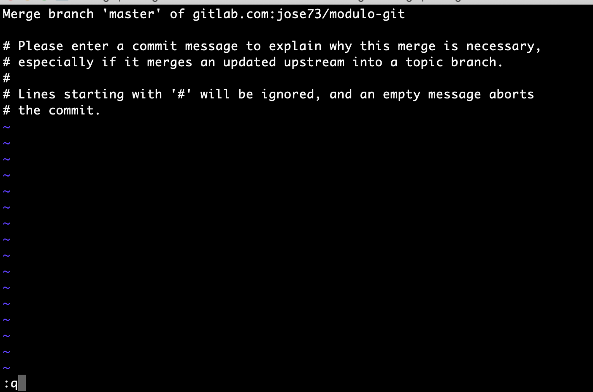

Se desplegará un mensaje donde podremos observar que se agrego el archivo **README** en nuestro directorio local, con el comando `ls` podremos visualizar el estado actual de nuestros archivos.

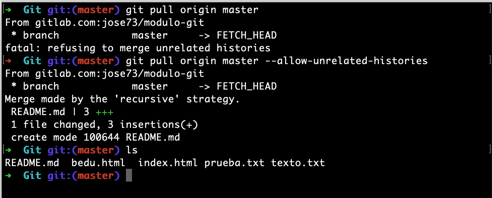

Usaremos el comando `git log --oneline --decorate --graph --all` para visualizar de manera gráfica la fusión de ramas realizada.

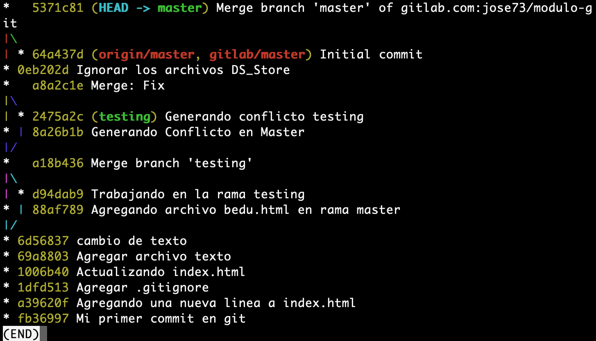

### Git Push

Para actualizar el repositorio remoto con los archivos que tengamos en nuestro repositorio local haremos uso del comando **[git push](https://www.youtube.com/watch?v=jgeLj45G0tk) (video tutorial)**, como se mencionó antes cuando trabajemos en repositorios colaborativos debemos tener cuidado de siempre primero descarga la versión más reciente del repositorio remoto con **git pull**, ya que si no efectuamos este paso podríamos sobre escribir los cambios que alguien más realizó.

Como buena práctica, realizaremos el comando `git pull`, antes de actualizar el repositorio remoto.

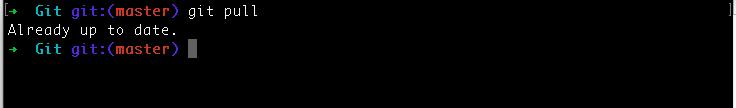

Una vez que obtuvimos como resultado el mensaje **Already up to date**, podemos proceder a usar el comando **git push**.

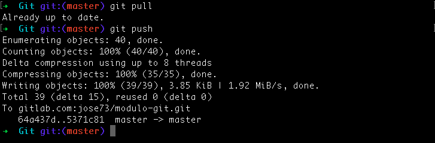

Si entramos a nuestra cuenta de [gitlab.com](https://about.gitlab.com/) podremos observar que los datos fueron cargados con exito.

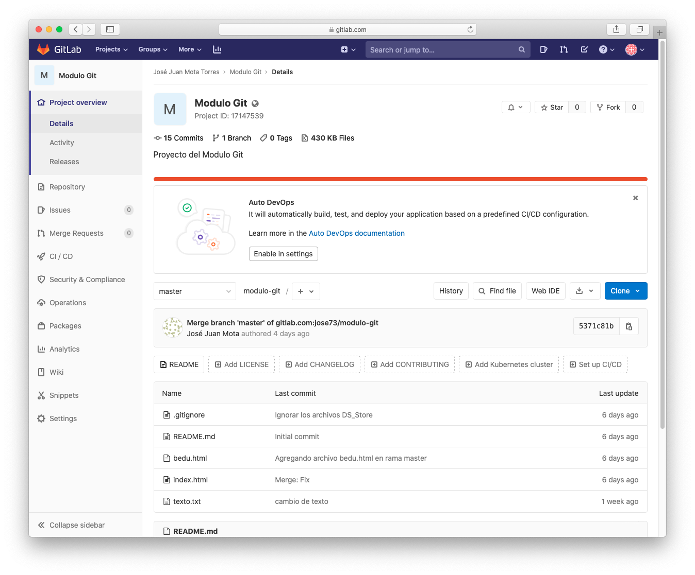

### GitHub

Github es el mayor proveedor de alojamiento de repositorios Git, también es conocido como el Facebook de los desarrolladores, recientemente fue comprado por Microsoft.

Un gran porcentaje de los repositorios Git se almacenan en GitHub, y muchos proyectos de código abierto lo utilizan para hospedar su Git, realizar su seguimiento de fallos, hacer revisiones de código y otras cosas. Por tanto, aunque no sea parte directa del proyecto de código abierto de Git, es muy probable que durante tu uso profesional de Git necesites interactuar con GitHub en algún momento.

**Creación y configuración de la cuenta**


Al igual que Gitlab es necesario crear una cuenta en [https://github.com](https://github.com) , donde debemos elegir nuestro nombre de usuario, proporcionar un correo y una contraseña.


Una vez creada nuestra cuenta debemos configurar nuestra **clave ssh**, nos dirigiremos a nuestro avatar ubicado en la parte superior derecha y una vez desplegado el menú seleccionaremos la opción de **settings**.


En el menú de lado izquierdo seleccionaremos la opción de **SSH and GPG Keys**.

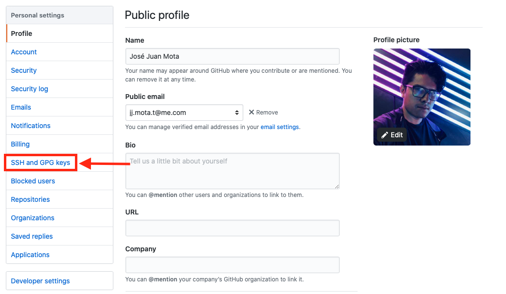

Abrimos nuestra terminal o git bash y entramos al directorio **.ssh** con el comando `cd .ssh` , desplegamos nuestras llaves existentes con el comando `ls` y mostraremos en pantalla nuestra llave pública con el comando `cat id_rsa.pub`, procederemos a copiar el código desplegado a nuestro portapapeles.

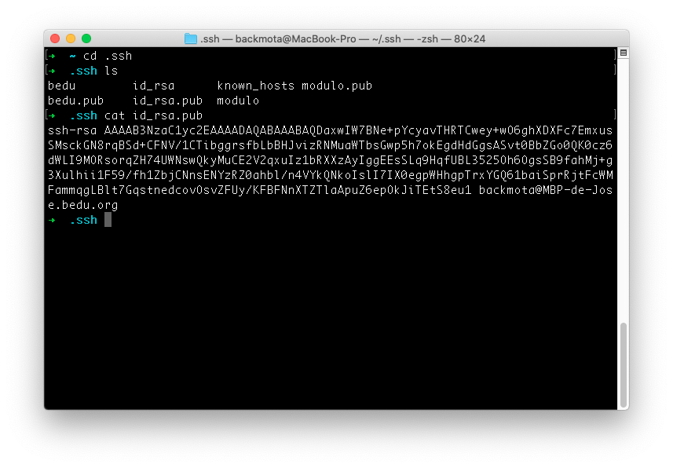

De regreso a nuestro navegador en la pestaña de configuración de ssh de Github, realizamos click sobre el botón verde **New SSH Key**.  


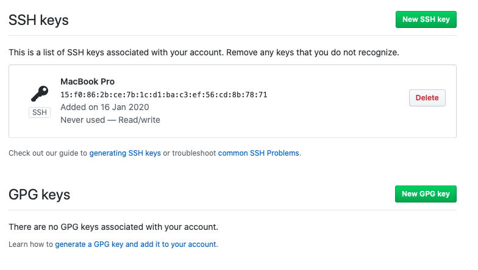

En la ventana desplegada pegaremos en el apartado de **Key** la **clave SSH** de nuestra terminal  y en Title pondremos un nombre con el cual identificamos la computadora de la cual proviene dicha clave, finalizamos con el botón **Add SSH Key**.


Procederemos a crear un repositorio remoto con el botón **+** que se encuentra en la parte superior derecha y seleccionamos la opción **New repository**.

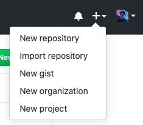

Asignaremos un nombre a nuestro repositorio, a diferencia de Gitlab para poder hacer uso de repositorios privados en Github se debe pagar una subscripción por lo que usaremos la casilla de público, no seleccionaremos la opción de crear el archivo Readme y finalizamos con el botón verde **Create repository**.

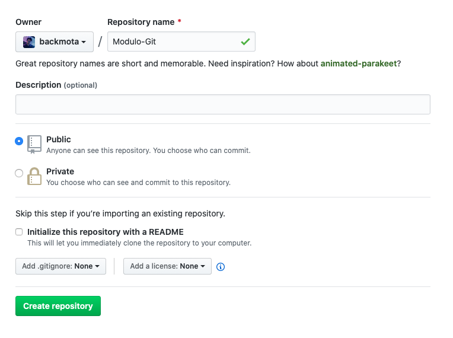

Nos desplegará algunas instrucciones, la primera de ella nos indica que en el caso de ser un nuevo repositorio local deberemos seguir dichas instrucciones para realizar nuestro primer push y en el caso de ya contar con un repositorio existente solo debemos agregar con **git remote** la dirección indicada y realizar **push**  con el comando `git push -u origin master `

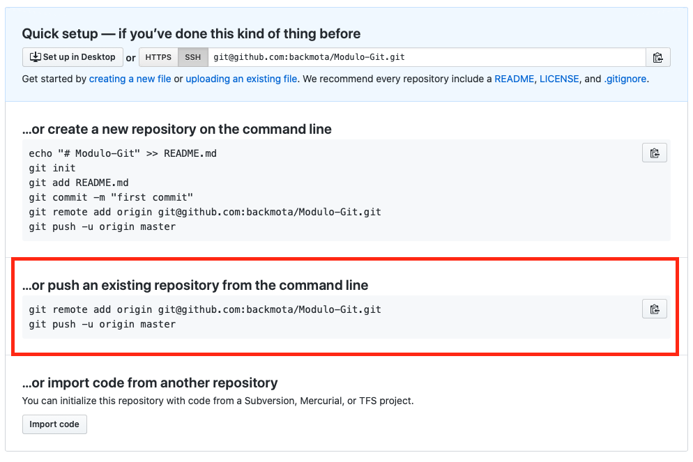

> Nota: Para evitar conflictos con nuestro repositorio que se encuentra trabajando con Gitlab deberemos crear una copia de nuestro repositorio completo, ingresamos a la nueva copia del repositorio y removemos el acceso remoto con `git remote rm origin`.

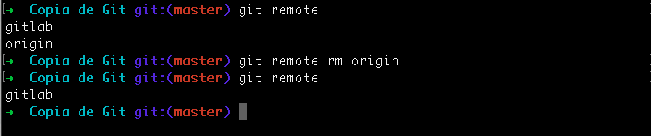

Procederemos a realizar las instrucciones de Github en nuestra terminal:

```
git remote add origin [url]

git push -u origin master
```

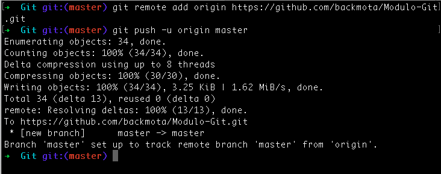

En este caso no fue necesario realizar un Pull antes del push debido a que el repositorio remoto se encontraba vacío, pero no debemos olvidar que cuando trabajemos de forma colaborativa siempre debemos realizar un pull antes de realizar cualquier push.

### Agregar una licencia

A continuación realizaremos un push después de realizar un nuevo commit, nos dirigiremos siguiente link [https://www.gnu.org/licenses/gpl-3.0.txt](https://www.gnu.org/licenses/gpl-3.0.txt) y con click derecho sobre el texto descargamos la licencia GPL 3.0, donde lo guardaremos con el título de **LICENSE** dentro del directorio de nuestro repositorio.

El uso de licencia es importante ya que especifica que nuestro contenido puede ser o no reutilizado y de qué manera. Para el software de GNU usamos únicamente licencias que son compatibles con la GPL de GNU. La documentación del software libre debe ser documentación libre, para que se pueda redistribuir y mejorar al igual que el software que describe.

Una vez agregada a nuestro directorio usaremos el comando `git add -A`  seguido por el comando `git commit -am "Licencia GNU 3.0"`  y realizaremos un push al repositorio remoto con `git push`.

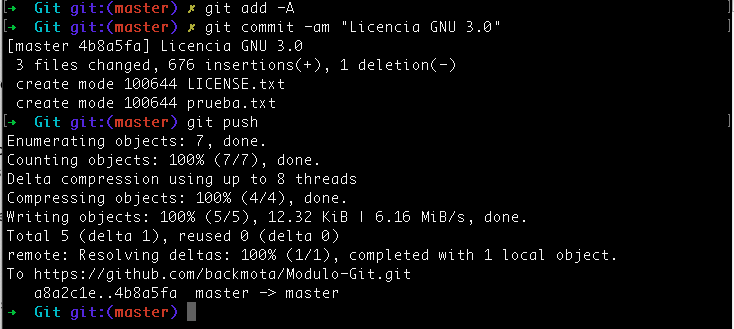

Si ingresamos al repositorio en nuestra cuenta de Github y abrimos el archivo **LICENSE**, Github nos proporciona un resumen de lo que dicha licencia nos permite hacer con el código publicado.

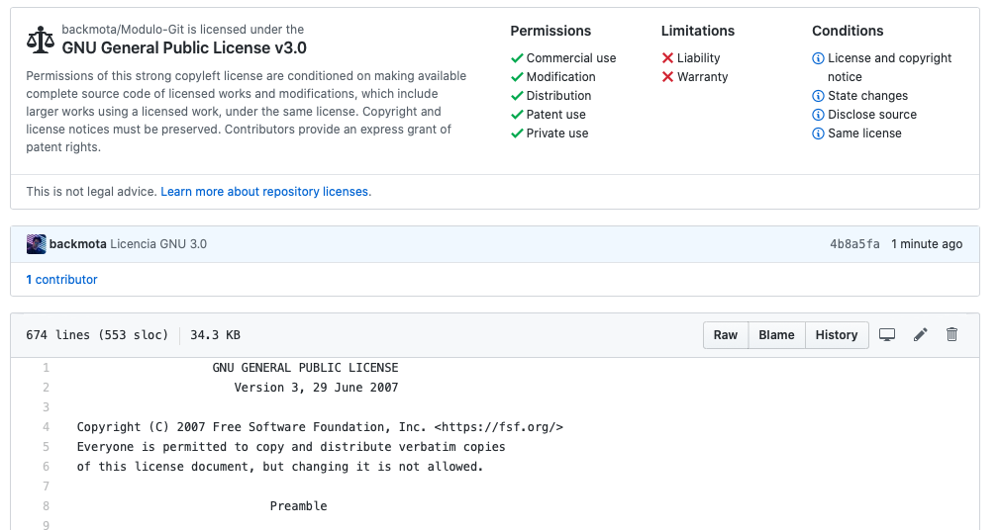


